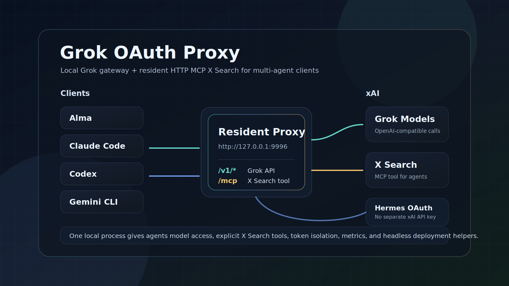

<p align="center">
  <a href="https://github.com/logicrw/grok-oauth-proxy">GitHub</a> ·
  <a href="#quick-start">Quick start</a> ·
  <a href="#mcp-x-search">MCP X Search</a> ·
  <a href="#headless-server">Headless server</a>
</p>

<p align="center">
  <a href="./README.md">English</a> ·
  <a href="./README.zh-CN.md">简体中文</a>
</p>

<p align="center">
  <strong>A local Grok OAuth gateway for multi-agent AI clients.</strong>
</p>

Grok OAuth Proxy turns a Hermes Agent xAI OAuth session into a local gateway
that AI clients can use in two ways:

1. **Model access:** call Grok through an OpenAI-compatible API without a
   separate xAI API key.
2. **Tool access:** expose xAI `x_search` as a resident HTTP MCP tool so
   non-Grok models can search X through the client tool layer.

This is the main difference of this fork: Alma, Claude Code-style clients,
Antigravity, Codex, Gemini CLI, LiteLLM, and other local agent setups can share
one proxy process for both Grok model calls and MCP X Search.

> Attribution: this fork is based on
> [yelixir-dev/grok-oauth-proxy](https://github.com/yelixir-dev/grok-oauth-proxy).
> The upstream project provides the Grok OAuth proxy and headless OAuth transfer
> flow. This fork adds the resident HTTP MCP `x_search` gateway and local
> multi-agent configuration.

## What This Solves

Hermes Agent can authorize xAI Grok with X Premium/Premium+ through OAuth. That
solves the credential problem, but most local AI clients still need:

- an OpenAI-compatible base URL for Grok models;
- a tool surface for X Search when the active model is Claude, GPT, Gemini, or
  another non-Grok model;
- a single resident process that several local agents can share;
- token isolation so the proxy does not race Hermes while refreshing OAuth.

Grok OAuth Proxy provides that layer.

```text
AI client provider config
        |
        | OpenAI-compatible API
        v
http://127.0.0.1:9996/v1/*
        |
        | Hermes-derived xAI OAuth bearer token
        v
https://api.x.ai/v1/*
```

```text
MCP-capable clients and agents
        |
        | HTTP MCP JSON-RPC
        v
http://127.0.0.1:9996/mcp
        |
        | xAI Responses API + x_search tool
        v
https://api.x.ai/v1/responses
```

Important boundary: non-Grok models do not become natively X-aware. Their client
calls this proxy's MCP `x_search` tool, and the proxy performs the search
through xAI using your local OAuth session.

## Core Features

**Grok model gateway**

Proxy OpenAI-compatible requests to xAI with Hermes-derived OAuth.

**Resident HTTP MCP X Search**

Expose one shared `/mcp` endpoint with an `x_search` tool for Alma and other
MCP-capable local clients.

**Non-Grok model tool access**

Let Claude, GPT, Gemini, and other models search X indirectly when their client
supports MCP tools.

**Independent token lifecycle**

Copy Hermes xAI OAuth into proxy-owned token state and refresh independently.

**Hermes auth compatibility**

Import both known Hermes auth shapes: `providers.xai-oauth` and
`credential_pool.xai-oauth`.

**Headless-friendly operations**

Export only xAI OAuth credentials to a server and run the proxy as a systemd
service or macOS LaunchAgent.

**Production guardrails**

Loopback binding by default, required `PROXY_API_KEY` for non-loopback binds,
private token-state permissions, sanitized upstream headers, deep health checks,
and Prometheus metrics.

## Quick Start

### 1. Prerequisites

- Python 3.9+
- Hermes Agent installed
- Hermes Agent already authorized with xAI Grok OAuth
- An xAI/X subscription or entitlement that allows the requested Grok/X Search
  features
- For X Search in non-Grok models: a client that supports HTTP MCP servers

Verify that Hermes has xAI OAuth credentials:

```bash
python -c 'import json, pathlib; data=json.load(open(pathlib.Path.home()/".hermes/auth.json")); print("xai-oauth present:", "xai-oauth" in data.get("providers", {}) or bool(data.get("credential_pool", {}).get("xai-oauth")))'
```

If it prints `False`, run Hermes Agent's xAI Grok OAuth flow first.

### 2. Install

```bash
git clone https://github.com/logicrw/grok-oauth-proxy.git
cd grok-oauth-proxy
./install.sh
```

### 3. Run

```bash
source .venv/bin/activate
python main.py
```

The default endpoint is:

```text
http://127.0.0.1:9996
```

If port `9996` is occupied, the app scans upward for an available port.

### 4. Smoke Test

```bash
curl -sS http://127.0.0.1:9996/health
```

```bash
curl -sS http://127.0.0.1:9996/health?deep=1
```

```bash
curl -sS http://127.0.0.1:9996/v1/chat/completions \
  -H "Content-Type: application/json" \
  -d '{
    "model": "grok-4.3",
    "messages": [{"role": "user", "content": "Reply with one short sentence."}]
  }'
```

## Configure AI Clients

### Alma Custom Provider

Use this when you want Alma to call Grok as a model.

```text
Provider Name: Grok OAuth Proxy
Base URL:      http://127.0.0.1:9996/v1
API Key:       dummy
API Format:    Chat Completions (/chat/completions)
```

Notes:

- The API key can be any non-empty placeholder if Alma requires one.
- The proxy strips client-supplied `Authorization` before forwarding and injects
  its own xAI OAuth bearer token.
- If a client appends `/v1` automatically, use `http://127.0.0.1:9996` instead
  of `http://127.0.0.1:9996/v1`.

### Alma MCP Server

Use this when you want Alma agents, including non-Grok models, to call X Search
through MCP.

```json
{
  "mcpServers": {
    "x_search": {
      "url": "http://127.0.0.1:9996/mcp"
    }
  }
}
```

The model provider and MCP server are separate integrations. Configure both if
you want Alma to use Grok as a model and expose X Search as a tool.

### LiteLLM

```yaml
model_list:
  - model_name: grok-4.3
    litellm_params:
      model: openai/grok-4.3
      api_base: http://127.0.0.1:9996/v1
      api_key: dummy
```

### OpenAI Python SDK

```python
from openai import OpenAI

client = OpenAI(
    base_url="http://127.0.0.1:9996/v1",
    api_key="dummy",
)

response = client.chat.completions.create(
    model="grok-4.3",
    messages=[{"role": "user", "content": "Say hello in one sentence."}],
)
print(response.choices[0].message.content)
```

## MCP X Search

The resident HTTP MCP endpoint is:

```text
POST http://127.0.0.1:9996/mcp
```

It exposes one tool: `x_search`.

| Argument | Type | Required | Description |
| --- | --- | --- | --- |
| `query` | string | yes | Natural-language search request. Include topic, handles, time window, and desired output. |
| `allowed_x_handles` | string array | no | Restrict search to handles such as `["elonmusk", "xai"]`. |
| `excluded_x_handles` | string array | no | Exclude handles. Cannot be used with `allowed_x_handles`. |
| `from_date` | string | no | ISO8601 search start date, for example `2026-05-18`. |
| `to_date` | string | no | Inclusive ISO8601 search end date, for example `2026-05-18`. Date-only values are normalized for xAI's current date-bound behavior. |
| `enable_image_understanding` | boolean | no | Ask xAI to use image understanding when supported. |
| `enable_video_understanding` | boolean | no | Ask xAI to use video understanding when supported. |
| `model` | string | no | xAI model for the MCP call. Defaults to `GROK_PROXY_MCP_MODEL` or `grok-4.3`. |
| `raw` | boolean | no | Return compact raw xAI response JSON instead of extracted text. |

List tools:

```bash
curl -sS http://127.0.0.1:9996/mcp \
  -H "Content-Type: application/json" \
  --data '{"jsonrpc":"2.0","id":1,"method":"tools/list","params":{}}'
```

Call X Search:

```bash
curl -sS http://127.0.0.1:9996/mcp \
  -H "Content-Type: application/json" \
  --data '{
    "jsonrpc": "2.0",
    "id": 2,
    "method": "tools/call",
    "params": {
      "name": "x_search",
      "arguments": {
        "query": "Search recent X posts from @xai about Hermes Agent. Reply in one short sentence.",
        "allowed_x_handles": ["xai"],
        "from_date": "2026-05-18",
        "to_date": "2026-05-18"
      }
    }
  }'
```

## Optional Auto X Search Shim

Some clients can call `/v1/responses` but cannot attach xAI server-side tools in
their provider UI. For those clients, the proxy can inject `x_search` into
Responses API requests.

It is disabled by default:

```bash
GROK_PROXY_AUTO_X_SEARCH=true python main.py
```

Optional restrictions:

```bash
GROK_PROXY_AUTO_X_SEARCH=true \
GROK_PROXY_X_SEARCH_ALLOWED_HANDLES=xai,elonmusk \
GROK_PROXY_X_SEARCH_IMAGE_UNDERSTANDING=true \
python main.py
```

Prefer MCP when possible. MCP makes tool use explicit and easier to debug. The
auto shim is a compatibility fallback.

## Headless Server

A reliable headless setup separates the desktop Hermes token chain from the
server proxy token chain.

Recommended split-chain flow:

```text
1. Authenticate Hermes locally with browser-based xAI OAuth.
2. Export only the xAI OAuth credentials.
3. Import those credentials on the headless proxy host.
4. Re-authenticate Hermes locally so Hermes and the proxy each own their own
   refresh-token chain.
```

Install on the server:

```bash
git clone https://github.com/logicrw/grok-oauth-proxy.git
cd grok-oauth-proxy
./install.sh --headless
```

Install and enable systemd:

```bash
./install.sh --headless --enable-service
```

Export xAI OAuth from the browser machine:

```bash
cd grok-oauth-proxy
python scripts/export_xai_oauth.py > ~/xai-oauth.json
```

Import it on the server:

```bash
scp ~/xai-oauth.json user@example.com:/tmp/xai-oauth.json
python scripts/import_xai_oauth.py /tmp/xai-oauth.json
rm -f /tmp/xai-oauth.json
chmod 700 ~/.hermes
chmod 600 ~/.hermes/auth.json
sudo systemctl restart grok-oauth-proxy
```

One-step remote refresh:

```bash
python scripts/refresh_remote_xai_oauth.py \
  --host user@example.com \
  --identity ~/.ssh/id_ed25519 \
  --print-reauth-command
```

The export file contains refresh tokens. Treat it like a password, do not commit
it, and delete it after import.

## Running Persistently

### macOS LaunchAgent

macOS service notes live in [services/README.md](services/README.md).

After code or environment changes:

```bash
launchctl kickstart -k gui/$(id -u)/io.logicrw.grok-oauth-proxy
```

### systemd

Example unit:

```ini
[Unit]
Description=Grok OAuth Proxy for Hermes
After=network.target

[Service]
Type=simple
User=youruser
WorkingDirectory=/home/youruser/grok-oauth-proxy
Environment=HOME=/home/youruser
Environment=HERMES_AUTH_PATH=/home/youruser/.hermes/auth.json
Environment=PATH=/home/youruser/grok-oauth-proxy/.venv/bin:/home/youruser/.local/bin:/usr/local/bin:/usr/bin:/bin
ExecStart=/home/youruser/grok-oauth-proxy/.venv/bin/python main.py
Restart=always
RestartSec=5

[Install]
WantedBy=multi-user.target
```

```bash
sudo systemctl daemon-reload
sudo systemctl enable --now grok-oauth-proxy
```

## Configuration

| Variable | Default | Description |
| --- | --- | --- |
| `PROXY_HOST` | `127.0.0.1` | Bind address. Non-loopback binds require `PROXY_API_KEY`. |
| `PROXY_PORT` | `9996` | Base port. If occupied, scans upward. |
| `PROXY_API_KEY` | unset | Optional local proxy auth key. Required when binding outside loopback. Accepted as `Authorization: Bearer <key>` or `X-Proxy-Api-Key: <key>`. |
| `GROK_PROXY_AUTH_STATE` | `~/.local/state/grok-oauth-proxy/auth_state.json` | Proxy-owned OAuth token state. |
| `HERMES_AUTH_PATH` | `~/.hermes/auth.json` | Hermes auth store. |
| `LOG_LEVEL` | `INFO` | Python app log level. |
| `TOKEN_REFRESH_WINDOW` | `300` | Seconds before expiry to refresh in the background. |
| `HERMES_POLL_INTERVAL` | `60` | Seconds between Hermes auth file checks. |
| `UPSTREAM_RETRY_ATTEMPTS` | `2` | Retry attempts for idempotent upstream requests and transient connection errors. |
| `UPSTREAM_RETRY_DELAY` | `1.0` | Base delay between upstream retries. |
| `GROK_PROXY_MCP_MODEL` | `grok-4.3` | Default xAI model used by MCP `x_search`. |
| `GROK_PROXY_MCP_X_SEARCH_CONCURRENCY` | `3` | Max concurrent MCP `x_search` calls. |
| `GROK_PROXY_AUTO_X_SEARCH` | `false` | Inject xAI `x_search` into `/v1/responses` requests. |
| `GROK_PROXY_X_SEARCH_ALLOWED_HANDLES` | unset | Comma-separated handle allowlist for auto-injected X Search. |
| `GROK_PROXY_X_SEARCH_IMAGE_UNDERSTANDING` | `false` | Enable image understanding for auto-injected X Search. |
| `GROK_PROXY_X_SEARCH_VIDEO_UNDERSTANDING` | `false` | Enable video understanding for auto-injected X Search. |

## Local Endpoints

| Endpoint | Method | Description |
| --- | --- | --- |
| `/health` | `GET` | Local status and token expiry. |
| `/health?deep=1` | `GET` | Status plus a real upstream `/v1/models` check. |
| `/metrics` | `GET` | Prometheus-compatible metrics. |
| `/mcp` | `POST` | HTTP JSON-RPC MCP endpoint exposing `x_search`. |
| `/{path:path}` | any | Forwarded to `https://api.x.ai/{path}`. |

## Security Notes

- Keep the proxy on `127.0.0.1` unless you have a clear reason to expose it.
- If binding to `0.0.0.0` or another non-loopback address, set `PROXY_API_KEY`
  and put TLS/authentication in front of it when crossing machines.
- Do not commit `auth_state.json`, `.hermes/auth.json`, exported
  `xai-oauth.json`, logs containing bearer tokens, or service files with real
  credentials.
- The proxy strips incoming `Authorization`, `Proxy-Authorization`, cookies,
  hop-by-hop headers, and spoofable forwarding headers before calling xAI.
- Uvicorn access logs are disabled by default to reduce accidental query-string
  logging.
- Local token files are written with private permissions when the proxy creates
  them.
- This project reuses the OAuth client identity Hermes obtained during xAI Grok
  OAuth login. Use it at your own discretion with respect to xAI's terms and
  account rules.

## Troubleshooting

### Alma can use Grok but cannot use X Search

Configure the MCP server separately:

```json
{
  "mcpServers": {
    "x_search": {
      "url": "http://127.0.0.1:9996/mcp"
    }
  }
}
```

### MCP lists the tool but calls fail

```bash
curl -sS http://127.0.0.1:9996/health?deep=1
curl -sS http://127.0.0.1:9996/metrics | rg mcp_x_search
```

Common causes:

- xAI OAuth needs Hermes re-authentication.
- The account does not have access to the requested model or X Search feature.
- `allowed_x_handles` is too restrictive.
- The client is calling `/mcp` with GET instead of POST.

### Base URL confusion

Use `http://127.0.0.1:9996/v1` when the client expects an OpenAI base URL.
Use `http://127.0.0.1:9996` when the client appends `/v1` itself.

## Development

```bash
python -m venv .venv
source .venv/bin/activate
pip install -r requirements-dev.txt
pytest -q
```

Useful checks before publishing:

```bash
git diff --check
pytest -q
rg -n "(ghp_|sk-[A-Za-z0-9_-]{20,}|xox[baprs]-|Bearer [A-Za-z0-9._-]{20,})" . -g '!README.md' -g '!README.zh-CN.md' -g '!*.pyc' -g '!__pycache__/**'
```

## License

MIT
