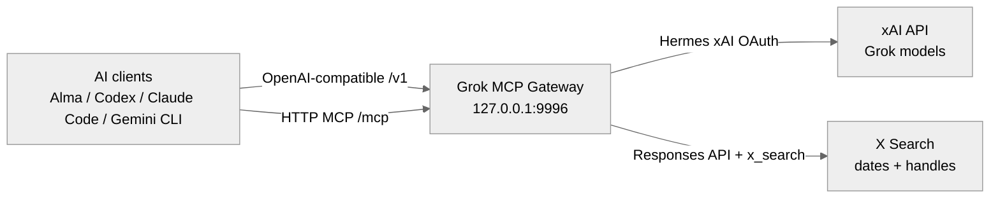

# Grok MCP Gateway

Local Grok model gateway plus Hermes/xAI OAuth-backed xAI `x_search` MCP for
local AI agents.

> `x_posts` and `x_latest_posts` are generated best-effort extraction tools over
> xAI `x_search`. They are not official X API timeline endpoints.



<p align="center">
  <a href="https://github.com/logicrw/grok-mcp-gateway">GitHub</a> ·
  <a href="#quick-start">Quick start</a> ·
  <a href="#mcp-x-search">MCP X Search</a> ·
  <a href="#headless-server">Headless server</a>
</p>

<p align="center">
  <a href="./README.md">English</a> ·
  <a href="./README.zh-CN.md">简体中文</a>
</p>

<p align="center">
  <strong>A local Grok and X Search gateway for multi-agent AI clients.</strong>
</p>

Grok MCP Gateway turns a Hermes Agent xAI OAuth session into a local gateway
that AI clients can use in two ways:

1. **Model access:** call Grok through an OpenAI-compatible API without a
   separate xAI API key.
2. **Tool access:** expose xAI `x_search` as a resident HTTP MCP tool so
   non-Grok models can search X through the client tool layer.

Important boundary: `x_posts` and `x_latest_posts` are structured best-effort
extraction tools over xAI `x_search`. They are not official X API timeline
endpoints, do not provide official pagination, and do not guarantee exact
metrics. Use the official X API or official X MCP server for API-grade
timelines, posting, compliance, or bulk data access.

No X Developer API credentials are required for this gateway. It uses the
Hermes/xAI OAuth session and xAI's `x_search` backend instead.

This is the main difference of this fork: Alma, Claude Code-style clients,
Antigravity, Codex, Gemini CLI, LiteLLM, and other local agent setups can share
one proxy process for both Grok model calls and MCP X Search.

> Attribution: this fork is based on
> [yelixir-dev/grok-oauth-proxy](https://github.com/yelixir-dev/grok-oauth-proxy).
> The upstream project provides the Grok OAuth proxy and headless OAuth transfer
> flow. This fork adds the resident HTTP MCP `x_search` gateway and local
> multi-agent configuration.

## What This Solves

Hermes Agent can authorize xAI Grok with X Premium/Premium+ through OAuth. That
solves the credential problem, but most local AI clients still need:

- an OpenAI-compatible base URL for Grok models;
- a tool surface for X Search when the active model is Claude, GPT, Gemini, or
  another non-Grok model;
- a single resident process that several local agents can share;
- token isolation so the proxy does not race Hermes while refreshing OAuth.

Grok MCP Gateway provides that layer.

Important boundary: non-Grok models do not become natively X-aware. Their client
calls this proxy's MCP `x_search` tool, and the proxy performs the search
through xAI using your local OAuth session.

## Relationship to Official X MCP

[X's official MCP documentation](https://docs.x.com/tools/mcp) describes two
different surfaces: the X API MCP server for X API actions and the X Docs MCP
server for querying documentation. Grok MCP Gateway is narrower: it keeps the
Hermes/xAI OAuth model gateway and exposes focused MCP tools backed by xAI
Responses API search.

Run the official X MCP server alongside this gateway if you need broader X API
actions such as account or posting workflows. Keep this gateway for local Grok
model access and OAuth-backed X Search that non-Grok agents can call through
their MCP tool layer.

## What This Is / Is Not

This project is:

- a local OpenAI-compatible gateway for Grok model calls through Hermes-derived
  xAI OAuth;
- a resident HTTP MCP server that exposes focused X Search tools;
- a shared local process for Alma, Codex, Claude Code, Gemini CLI, Antigravity,
  LiteLLM, and similar agent clients.

This project is not:

- a general MCP router, MCP marketplace, or remote-tool aggregator;
- a replacement for the official X API MCP server when you need posting,
  account management, official timelines, pagination, metrics, compliance
  archives, or broader X API actions;
- a Node.js, npm, Express, Docker, or Heroku template;
- a way to make every model natively X-aware. Non-Grok models can search X only
  when their client chooses to call the exposed MCP tool.

## Release Status

Current status: `v0.1.0-preview` candidate.

Preview means:

- tested locally and in clean CI-style environments without live xAI
  credentials;
- live xAI smoke tests are manual because OAuth tokens are user-local;
- `x_posts` is generated extraction, not an official X timeline;
- MCP compatibility is verified only for clients listed in the matrix below;
- tool schemas may still change before a stable release.

## Core Features

**Grok model gateway**

Proxy OpenAI-compatible requests to xAI with Hermes-derived OAuth.

**Resident HTTP MCP X Search**

Expose one shared `/mcp` endpoint with X Search tools for Alma and other
MCP-capable local clients.

**Non-Grok model tool access**

Let Claude, GPT, Gemini, and other models search X indirectly when their client
supports MCP tools.

**Independent token lifecycle**

Copy Hermes xAI OAuth into proxy-owned token state and refresh independently.

**Hermes auth compatibility**

Import both known Hermes auth shapes: `providers.xai-oauth` and
`credential_pool.xai-oauth`.

**Headless-friendly operations**

Export only xAI OAuth credentials to a server and run the proxy as a systemd
service or macOS LaunchAgent.

**Production guardrails**

Loopback binding by default, required `PROXY_API_KEY` for non-loopback binds,
private token-state permissions, sanitized upstream headers, deep health checks,
and Prometheus metrics.

## Quick Start

### 1. Prerequisites

- Python 3.9+
- Hermes Agent installed
- Hermes Agent already authorized with xAI Grok OAuth
- An xAI/X subscription or entitlement that allows the requested Grok/X Search
  features
- For X Search in non-Grok models: a client that supports HTTP MCP servers

Verify that Hermes has xAI OAuth credentials:

```bash
python -c 'import json, pathlib; data=json.load(open(pathlib.Path.home()/".hermes/auth.json")); print("xai-oauth present:", "xai-oauth" in data.get("providers", {}) or bool(data.get("credential_pool", {}).get("xai-oauth")))'
```

If it prints `False`, run Hermes Agent's xAI Grok OAuth flow first.

### 2. Install

```bash
git clone https://github.com/logicrw/grok-mcp-gateway.git
cd grok-mcp-gateway
./install.sh
```

### 3. Run

```bash
source .venv/bin/activate
python main.py
```

The default endpoint is:

```text
http://127.0.0.1:9996
```

Service mode fails fast if port `9996` is occupied, because local clients are
usually pinned to that port. Set `PROXY_PORT` to another value, or enable
`GROK_GATEWAY_PORT_AUTOSCAN=1` only for development.

### 4. Smoke Test

```bash
curl -sS http://127.0.0.1:9996/health
```

```bash
curl -sS http://127.0.0.1:9996/health?deep=1
```

```bash
curl -sS http://127.0.0.1:9996/v1/chat/completions \
  -H "Content-Type: application/json" \
  -d '{
    "model": "grok-4.3",
    "messages": [{"role": "user", "content": "Reply with one short sentence."}]
  }'
```

```bash
curl -sS http://127.0.0.1:9996/mcp \
  -H "Content-Type: application/json" \
  --data '{"jsonrpc":"2.0","id":1,"method":"tools/list","params":{}}'
```

## Configure AI Clients

### Compatibility Matrix

| Client | `/v1` model gateway | HTTP MCP `/mcp` | Verified date | Notes |
| --- | --- | --- | --- | --- |
| Alma | verified | verified | 2026-05-19 | Separate model provider and MCP config. |
| LiteLLM | verified | not applicable | 2026-05-19 | `/v1` only. |
| OpenAI SDK | verified | not applicable | 2026-05-19 | `/v1` only. |
| Codex | expected | expected | not yet reverified | Local config shape is known, but client behavior should be rechecked per release. |
| Claude Code | expected | expected | not yet reverified | Local config shape is known, but client behavior should be rechecked per release. |
| Gemini CLI | expected | expected | not yet reverified | Local config shape is known, but client behavior should be rechecked per release. |
| Antigravity | expected | expected | not yet reverified | Uses an HTTP MCP bridge in some setups. |

### Alma Custom Provider

Use this when you want Alma to call Grok as a model.

```text
Provider Name: Grok MCP Gateway
Base URL:      http://127.0.0.1:9996/v1
API Key:       dummy
API Format:    Chat Completions (/chat/completions)
```

Notes:

- The API key can be any non-empty placeholder if Alma requires one.
- The proxy strips client-supplied `Authorization` before forwarding and injects
  its own xAI OAuth bearer token.
- If a client appends `/v1` automatically, use `http://127.0.0.1:9996` instead
  of `http://127.0.0.1:9996/v1`.

### Alma MCP Server

Use this when you want Alma agents, including non-Grok models, to call X Search
through MCP.

```json
{
  "mcpServers": {
    "x_search": {
      "url": "http://127.0.0.1:9996/mcp"
    }
  }
}
```

The model provider and MCP server are separate integrations. Configure both if
you want Alma to use Grok as a model and expose X Search as a tool.

### LiteLLM

```yaml
model_list:
  - model_name: grok-4.3
    litellm_params:
      model: openai/grok-4.3
      api_base: http://127.0.0.1:9996/v1
      api_key: dummy
```

### OpenAI Python SDK

```python
from openai import OpenAI

client = OpenAI(
    base_url="http://127.0.0.1:9996/v1",
    api_key="dummy",
)

response = client.chat.completions.create(
    model="grok-4.3",
    messages=[{"role": "user", "content": "Say hello in one sentence."}],
)
print(response.choices[0].message.content)
```

## MCP X Search

The resident HTTP MCP endpoint is:

```text
POST http://127.0.0.1:9996/mcp
```

It exposes three tools by default:

- `x_search` for open-ended X search and topic discovery.
- `x_posts` for structured best-effort post extraction by handles, topic,
  flexible time range, and best-effort filters.
- `x_latest_posts` as a convenience shortcut for recent posts from one handle.

### `x_search`

| Argument | Type | Required | Description |
| --- | --- | --- | --- |
| `query` | string | yes | Natural-language search request. Include topic, handles, time window, and desired output. |
| `allowed_x_handles` | string array | no | Restrict search to handles such as `["elonmusk", "xai"]`. |
| `excluded_x_handles` | string array | no | Exclude handles. Cannot be used with `allowed_x_handles`. |
| `from_date` | string | no | ISO8601 search start date, for example `2026-05-18`. |
| `to_date` | string | no | Inclusive ISO8601 search end date, for example `2026-05-18`. Date-only values are passed through unchanged. |
| `enable_image_understanding` | boolean | no | Ask xAI to use image understanding when supported. |
| `enable_video_understanding` | boolean | no | Ask xAI to use video understanding when supported. |
| `model` | string | no | xAI model for the MCP call. Defaults to `GROK_PROXY_MCP_MODEL` or `grok-4.3`. |
| `raw` | boolean | no | Return compact raw xAI response JSON instead of extracted text. |

### `x_posts`

This is the structured best-effort extraction surface. It still uses xAI
`x_search` under the hood, but the gateway compiles common time phrases and
asks for `x_posts.v1` structured JSON instead of a prose summary. The result is
always labeled with `timeline_verified: false`.

| Argument | Type | Required | Description |
| --- | --- | --- | --- |
| `handles` | string array | no | Optional author handles, with or without `@`. Supports up to 10 handles. |
| `query` | string | no | Optional topic or keyword filter, for example `Hermes Agent`. |
| `time_range` | string | no | Natural-language time window, for example `上上周`, `4月1日到4月2日`, `最近30天`, `2026年4月`, or `不限`. Defaults to the last 30 days. |
| `from_date` | string | no | ISO8601 search start date. Overrides `time_range` start. |
| `to_date` | string | no | Inclusive ISO8601 search end date. Overrides `time_range` end. |
| `count` | integer | no | Target number of posts. Defaults to `10`, max `20`. |
| `sort` | string | no | `latest` or `relevance`. Defaults to `latest`. |
| `include_replies` | boolean | no | Whether replies may be included when xAI can find them. Defaults to `true`. |
| `include_reposts` | boolean | no | Whether reposts may be included when xAI can distinguish them. Defaults to `true`. |
| `best_effort_filters` | object | no | Best-effort prompt filters: `min_likes`, `min_reposts`, `min_replies`, `min_views`. These are not official X API filters. |
| `model` | string | no | xAI model for the MCP call. Defaults to `GROK_PROXY_MCP_MODEL` or `grok-4.3`. |

`x_posts` requires at least one of `handles` or `query`.
`engagement_filter` is still accepted as a deprecated compatibility alias for
`best_effort_filters`.

For exact author timelines, pagination, tweet fields, public metrics, or
compliance-sensitive use, use official X API timeline endpoints or official X
MCP.

All `x_posts` and `x_latest_posts` results include:

```json
{
  "schema_version": "x_posts.v1",
  "tool_version": "0.1.0",
  "backend": "xai_x_search_generated",
  "timeline_verified": false,
  "source_limit": "Generated extraction via xAI x_search. Not official X API timeline.",
  "warnings": [],
  "filter_reliability": {
    "author": "x_search_tool_parameter",
    "date": "x_search_tool_parameter",
    "query": "prompt_filter",
    "engagement": "best_effort_prompt_filter"
  },
  "request": {},
  "sources": [],
  "posts": []
}
```

### `x_latest_posts`

Shortcut for `x_posts` with one handle, `sort=latest`, and a default 30-day
lookback. It is not an official X API timeline.

| Argument | Type | Required | Description |
| --- | --- | --- | --- |
| `handle` | string | yes | Single X handle, with or without `@`, for example `0xlogicrw`. |
| `count` | integer | no | Target number of recent posts. Defaults to `10`, max `20`. |
| `lookback_days` | integer | no | Default recency window when `from_date` is omitted. Defaults to `30`. |
| `from_date` | string | no | ISO8601 search start date. Overrides `lookback_days`. |
| `to_date` | string | no | Inclusive ISO8601 search end date. Defaults to today. |
| `include_replies` | boolean | no | Whether replies may be included when xAI can find them. Defaults to `true`. |
| `model` | string | no | xAI model for the MCP call. Defaults to `GROK_PROXY_MCP_MODEL` or `grok-4.3`. |

List tools:

```bash
curl -sS http://127.0.0.1:9996/mcp \
  -H "Content-Type: application/json" \
  --data '{"jsonrpc":"2.0","id":1,"method":"tools/list","params":{}}'
```

Call X Search:

```bash
curl -sS http://127.0.0.1:9996/mcp \
  -H "Content-Type: application/json" \
  --data '{
    "jsonrpc": "2.0",
    "id": 2,
    "method": "tools/call",
    "params": {
      "name": "x_search",
      "arguments": {
        "query": "Search recent X posts from @xai about Hermes Agent. Reply in one short sentence.",
        "allowed_x_handles": ["xai"],
        "from_date": "2026-05-18",
        "to_date": "2026-05-18"
      }
    }
  }'
```

Call structured posts extraction:

```bash
curl -sS http://127.0.0.1:9996/mcp \
  -H "Content-Type: application/json" \
  --data '{
    "jsonrpc": "2.0",
    "id": 3,
    "method": "tools/call",
    "params": {
      "name": "x_posts",
      "arguments": {
        "handles": ["0xlogicrw", "xai"],
        "query": "Hermes Agent",
        "time_range": "上上周",
        "count": 10,
        "sort": "latest",
        "best_effort_filters": {
          "min_views": 10000000
        }
      }
    }
  }'
```

Call latest posts extraction:

```bash
curl -sS http://127.0.0.1:9996/mcp \
  -H "Content-Type: application/json" \
  --data '{
    "jsonrpc": "2.0",
    "id": 4,
    "method": "tools/call",
    "params": {
      "name": "x_latest_posts",
      "arguments": {
        "handle": "0xlogicrw",
        "count": 10,
        "lookback_days": 30
      }
    }
  }'
```

## Optional Auto X Search Shim

Some clients can call `/v1/responses` but cannot attach xAI server-side tools in
their provider UI. For those clients, the proxy can inject `x_search` into
Responses API requests.

It is disabled by default:

```bash
GROK_PROXY_AUTO_X_SEARCH=true python main.py
```

Optional restrictions:

```bash
GROK_PROXY_AUTO_X_SEARCH=true \
GROK_PROXY_X_SEARCH_ALLOWED_HANDLES=xai,elonmusk \
GROK_PROXY_X_SEARCH_IMAGE_UNDERSTANDING=true \
python main.py
```

Prefer MCP when possible. MCP makes tool use explicit and easier to debug. The
auto shim is a compatibility fallback.

## Headless Server

A reliable headless setup separates the desktop Hermes token chain from the
server proxy token chain.

Recommended split-chain flow:

```text
1. Authenticate Hermes locally with browser-based xAI OAuth.
2. Export only the xAI OAuth credentials.
3. Import those credentials on the headless proxy host.
4. Re-authenticate Hermes locally so Hermes and the proxy each own their own
   refresh-token chain.
```

Install on the server:

```bash
git clone https://github.com/logicrw/grok-mcp-gateway.git
cd grok-mcp-gateway
./install.sh --headless
```

Install and enable systemd:

```bash
./install.sh --headless --enable-service
```

Export xAI OAuth from the browser machine:

```bash
cd grok-mcp-gateway
python scripts/export_xai_oauth.py > ~/xai-oauth.json
```

Import it on the server:

```bash
scp ~/xai-oauth.json user@example.com:/tmp/xai-oauth.json
python scripts/import_xai_oauth.py /tmp/xai-oauth.json
rm -f /tmp/xai-oauth.json
chmod 700 ~/.hermes
chmod 600 ~/.hermes/auth.json
sudo systemctl restart grok-mcp-gateway
```

One-step remote refresh:

```bash
python scripts/refresh_remote_xai_oauth.py \
  --host user@example.com \
  --identity ~/.ssh/id_ed25519 \
  --print-reauth-command
```

The export file contains refresh tokens. Treat it like a password, do not commit
it, and delete it after import.

## Running Persistently

### macOS LaunchAgent

macOS service notes live in [services/service-examples.md](services/service-examples.md).

After code or environment changes:

```bash
launchctl kickstart -k gui/$(id -u)/io.logicrw.grok-mcp-gateway
```

### systemd

Example unit:

```ini
[Unit]
Description=Grok MCP Gateway for Hermes
After=network.target

[Service]
Type=simple
User=youruser
WorkingDirectory=/home/youruser/grok-mcp-gateway
Environment=HOME=/home/youruser
Environment=HERMES_AUTH_PATH=/home/youruser/.hermes/auth.json
Environment=PATH=/home/youruser/grok-mcp-gateway/.venv/bin:/home/youruser/.local/bin:/usr/local/bin:/usr/bin:/bin
ExecStart=/home/youruser/grok-mcp-gateway/.venv/bin/python main.py
Restart=always
RestartSec=5

[Install]
WantedBy=multi-user.target
```

```bash
sudo systemctl daemon-reload
sudo systemctl enable --now grok-mcp-gateway
```

## Configuration

| Variable | Default | Description |
| --- | --- | --- |
| `PROXY_HOST` | `127.0.0.1` | Bind address. Non-loopback binds require `PROXY_API_KEY`. |
| `PROXY_PORT` | `9996` | Fixed listen port by default. If occupied, startup fails unless `GROK_GATEWAY_PORT_AUTOSCAN=1` is set. |
| `GROK_GATEWAY_PORT_AUTOSCAN` | `false` | Development-only port scan fallback. Keep disabled for resident client configs pinned to `9996`. |
| `PROXY_API_KEY` | unset | Optional local proxy auth key. Required when binding outside loopback. Non-loopback keys must be at least 16 characters; 32+ random characters are recommended. Accepted as `Authorization: Bearer <key>` or `X-Proxy-Api-Key: <key>`. |
| `GROK_PROXY_AUTH_STATE` | `~/.local/state/grok-oauth-proxy/auth_state.json` | Proxy-owned OAuth token state. |
| `HERMES_AUTH_PATH` | `~/.hermes/auth.json` | Hermes auth store. |
| `XAI_API_KEY` | unset | Optional xAI API-key fallback when Hermes OAuth token resolution fails. |
| `XAI_API_KEY_FILE` | unset | Optional path to a private file containing the xAI API-key fallback. Prefer this for LaunchAgent/systemd services so secrets are not embedded in service definitions. |
| `LOG_LEVEL` | `INFO` | Python app log level. |
| `TOKEN_REFRESH_WINDOW` | `300` | Seconds before expiry to refresh in the background. |
| `HERMES_POLL_INTERVAL` | `60` | Seconds between Hermes auth file checks. |
| `UPSTREAM_RETRY_ATTEMPTS` | `2` | Retry attempts for idempotent upstream requests and transient connection errors. |
| `UPSTREAM_RETRY_DELAY` | `1.0` | Base delay between upstream retries. |
| `GROK_PROXY_MCP_MODEL` | `grok-4.3` | Default xAI model used by MCP `x_search`. |
| `GROK_GATEWAY_MCP_TOOL_ALLOWLIST` | `x_search,x_posts,x_latest_posts` | Comma-separated MCP tool allowlist. Set it explicitly before adding or exposing more tools. |
| `GROK_PROXY_MCP_X_SEARCH_CONCURRENCY` | `3` | Max concurrent MCP `x_search` calls. |
| `GROK_GATEWAY_DEBUG_UPSTREAM_ERRORS` | `false` | Log sanitized upstream error bodies for debugging. Tool results never return raw upstream bodies. |
| `GROK_PROXY_AUTO_X_SEARCH` | `false` | Inject xAI `x_search` into `/v1/responses` requests. |
| `GROK_PROXY_X_SEARCH_ALLOWED_HANDLES` | unset | Comma-separated handle allowlist for auto-injected X Search. |
| `GROK_PROXY_X_SEARCH_IMAGE_UNDERSTANDING` | `false` | Enable image understanding for auto-injected X Search. |
| `GROK_PROXY_X_SEARCH_VIDEO_UNDERSTANDING` | `false` | Enable video understanding for auto-injected X Search. |

The `GROK_PROXY_*` environment prefix and the default token-state path are kept
for upgrade compatibility with earlier installs.

## Local Endpoints

| Endpoint | Method | Description |
| --- | --- | --- |
| `/health` | `GET` | Local status and token expiry. |
| `/health?deep=1` | `GET` | Status plus a real upstream `/v1/models` check. |
| `/metrics` | `GET` | Prometheus-compatible metrics. |
| `/mcp` | `POST` | HTTP JSON-RPC MCP endpoint exposing `x_search`, `x_posts`, and `x_latest_posts` by default. |
| `/{path:path}` | any | Forwarded to `https://api.x.ai/{path}`. |

## Security Notes

- Keep the proxy on `127.0.0.1` unless you have a clear reason to expose it.
- If binding to `0.0.0.0` or another non-loopback address, set `PROXY_API_KEY`
  and put TLS/authentication in front of it when crossing machines.
- `PROXY_API_KEY` is a shared bearer secret, not transport security. Use SSH
  tunneling or a TLS reverse proxy for any non-local traffic.
- Do not commit `auth_state.json`, `.hermes/auth.json`, exported
  `xai-oauth.json`, logs containing bearer tokens, or service files with real
  credentials.
- The proxy strips incoming `Authorization`, `Proxy-Authorization`, cookies,
  hop-by-hop headers, and spoofable forwarding headers before calling xAI.
- Uvicorn access logs are disabled by default to reduce accidental query-string
  logging.
- Local token files are written with private permissions when the proxy creates
  them.
- This project reuses the OAuth client identity Hermes obtained during xAI Grok
  OAuth login. Use it at your own discretion with respect to xAI's terms and
  account rules.

## Troubleshooting

### Alma can use Grok but cannot use X Search

Configure the MCP server separately:

```json
{
  "mcpServers": {
    "x_search": {
      "url": "http://127.0.0.1:9996/mcp"
    }
  }
}
```

### MCP lists the tool but calls fail

```bash
curl -sS http://127.0.0.1:9996/health?deep=1
curl -sS http://127.0.0.1:9996/metrics | rg mcp_x_search
```

Common causes:

- `GROK_GATEWAY_MCP_TOOL_ALLOWLIST` does not include the tool you are calling, for example `x_search` or `x_posts`.
- xAI OAuth needs Hermes re-authentication.
- The account does not have access to the requested model or X Search feature.
- `allowed_x_handles` is too restrictive.
- The client is calling `/mcp` with GET instead of POST.

### Base URL confusion

Use `http://127.0.0.1:9996/v1` when the client expects an OpenAI base URL.
Use `http://127.0.0.1:9996` when the client appends `/v1` itself.

## Development

```bash
python -m venv .venv
source .venv/bin/activate
pip install -r requirements-dev.txt
pytest -q
```

Useful checks before publishing:

```bash
git diff --check
pytest -q
rg -n "(ghp_|sk-[A-Za-z0-9_-]{20,}|xox[baprs]-|Bearer [A-Za-z0-9._-]{20,})" . -g '!README.md' -g '!README.zh-CN.md' -g '!*.pyc' -g '!__pycache__/**'
```

## License

MIT
