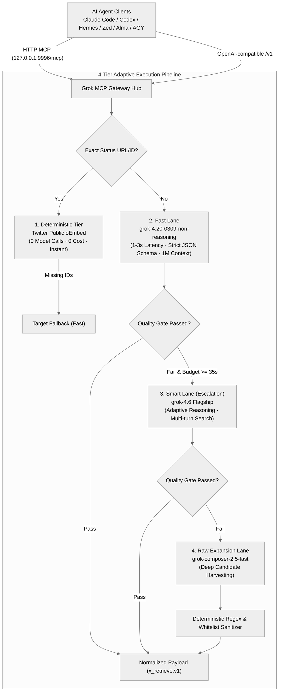

# Grok MCP Gateway

> **An enterprise-grade, multi-tier intelligent retrieval gateway & Model Context Protocol (MCP) server for X/Twitter discourse, powered by xAI frontier models.**

`grok-mcp-gateway` acts as a high-performance, single-point retrieval hub for all your local AI coding agents (Claude Code, Cursor, Codex, Hermes, Zed, Alma, Antigravity, etc.). It abstracts model differences, rate limits, token rotations, and latency behind a clean, deterministic interface: **`x_retrieve`**.


```mermaid
---
config:
  theme: neutral
---
flowchart TD
    Clients["AI Agent Clients<br/>Claude Code / Codex / Hermes / Zed / Alma / AGY"] -->|"HTTP MCP (127.0.0.1:9996/mcp)"| Gateway["Grok MCP Gateway Hub"]
    Clients -->|"OpenAI-compatible /v1"| Gateway

    subgraph Pipeline ["4-Tier Adaptive Execution Pipeline"]
        direction TB
        Gateway --> Check{"Exact Status URL/ID?"}
        Check -- "Yes" --> Deterministic["1. Deterministic Tier<br/>Twitter Public oEmbed<br/>(0 Model Calls · 0 Cost · Instant)"]
        Check -- "No" --> Fast["2. Fast Lane<br/>grok-4.20-0309-non-reasoning<br/>(1-3s Latency · Strict JSON Schema · 1M Context)"]
        Deterministic -- "Missing IDs" --> FastFallback["Target Fallback (Fast)"]
        Fast --> QualityGate{"Quality Gate Passed?"}
        QualityGate -- "Pass" --> Output["Normalized Payload (x_retrieve.v1)"]
        QualityGate -- "Fail & Budget >= 35s" --> Smart["3. Smart Lane (Escalation)<br/>grok-4.6 Flagship<br/>(Adaptive Reasoning · Multi-turn Search)"]
        Smart --> SmartQuality{"Quality Gate Passed?"}
        SmartQuality -- "Pass" --> Output
        SmartQuality -- "Fail" --> Raw["4. Raw Expansion Lane<br/>grok-composer-2.5-fast<br/>(Deep Candidate Harvesting)"]
        Raw --> Filter["Deterministic Regex & Whitelist Sanitizer"] --> Output
    end
```

<p align="center">
  <a href="./README.md">English</a> ·
  <a href="./README.zh-CN.md">简体中文</a> ·
  <a href="#key-architectural-highlights">Architecture</a> ·
  <a href="#quick-start">Quick Start</a> ·
  <a href="#configure-ai-clients">Client Setup</a> ·
  <a href="#configuration">Configuration</a>
</p>

---

## Key Architectural Highlights

### 1. 4-Tier Adaptive Execution Pipeline
Instead of naively forwarding every query to expensive reasoning models, the gateway optimizes latency, cost, and reliability across four specialized execution tiers:

1. **Deterministic Tier (Twitter Public oEmbed First)**:
   - For queries with explicit X status URLs or 15–20 digit IDs, public oEmbed is queried concurrently first.
   - If verified tweet text is retrieved, **model calls drop to 0** (0 cost, millisecond latency, zero hallucination).
2. **Fast Lane (`grok-4.20-0309-non-reasoning`)**:
   - Handles rolling timeline lookups (`latest_by_handle`) and simple structured post searches.
   - Built on xAI's non-thinking engine: **1–3s instant response**, 1M context window, and zero reasoning delay.
3. **Smart Lane (`grok-4.6` Flagship)**:
   - Dedicated engine for complex semantic research, source discovery, reaction tracking, and claim verification.
   - Dynamically mounts validated reasoning effort (`low`, `medium`, `high`, `xhigh`) and multi-turn agentic `x_search`.
4. **Raw Expansion Lane (`grok-composer-2.5-fast`)**:
   - High-throughput candidate extraction fallback for cold or scarce topics, strictly sanitized by deterministic regex parsers and URL whitelists before entering results.

### 2. Autonomous Quality Gate & Self-Healing Escalation
- **Real-Time Assessment**: Assesses returned item count against `min_items`, validates canonical status URLs, and checks original text completeness.
- **Budget-Aware Silent Escalation**: If the Fast Lane yields incomplete or empty results and the remaining request budget is sufficient ($\ge 35\text{s}$), the gateway transparently escalates the task to **Grok 4.6** without client intervention.

### 3. Multi-Agent Single-Flight OAuth Coalescing
- Specifically designed for multi-agent local developer environments.
- When multiple AI agents (e.g. Claude + Codex + Hermes) trigger simultaneous requests during token expiration, concurrent 401s coalesce into a single-flight lock—triggering **exactly one upstream OAuth refresh** and eliminating token rotation race conditions.

### 4. Native Structured Outputs & Turn Governance
- Enforces strict JSON Schema validation (`strict: true`) directly at the xAI Responses API level (`text.format.json_schema`).
- Enforces bounded tool turns (`max_turns=2` for Fast, `max_turns=3` for Smart) and explicit `store: false` to eliminate runaway agent loops and minimize spend.

### 5. Production Observability & Telemetry
- Built-in Prometheus exporter at `/metrics` tracking:
  - Final retrieval status (`ok`, `empty`, `no_match`, `degraded`, `error`)
  - Stage execution durations and timeout boundaries
  - Upstream token usage, reasoning tokens, and tool call counts
  - Exact USD billing ticks parsed from upstream (`cost_in_usd_ticks`)

---

## Quick Start

### 1. Installation

```bash
git clone https://github.com/logicrw/grok-mcp-gateway.git
cd grok-mcp-gateway
python3 -m venv .venv
source .venv/bin/activate
pip install -r requirements.txt
```

### 2. Standalone xAI OAuth Authentication

On a clean machine with no existing credentials, authenticate natively in your browser:

```bash
# Authenticate in browser and start the gateway immediately
python main.py --login

# Or authenticate only and exit
python main.py --login-only
# Or via standalone script
python scripts/login_xai_oauth.py
```

### 3. Launch the Gateway

```bash
# Start the resident server (default port 9996)
python main.py
```

Check health:
```bash
curl -sS http://127.0.0.1:9996/health
# {"status":"ok","provider":"xai-oauth","mcp":{"enabled_tools":["x_retrieve"]...}}
```

### 4. Background Service (macOS LaunchAgent)


To run the gateway as a permanent background service on macOS, copy the LaunchAgent example from `services/service-examples.md` into `~/Library/LaunchAgents/io.logicrw.grok-mcp-gateway.plist`, replace the `YOUR_USERNAME` placeholders, then load it:

```bash
launchctl bootstrap gui/$(id -u) ~/Library/LaunchAgents/io.logicrw.grok-mcp-gateway.plist
launchctl kickstart -k gui/$(id -u)/io.logicrw.grok-mcp-gateway
```

---

## Configure AI Clients

The resident MCP endpoint is:
```text
http://127.0.0.1:9996/mcp
```

### Claude Code (`~/.claude.json`)
```json
{
  "mcpServers": {
    "grok_mcp_gateway": {
      "url": "http://127.0.0.1:9996/mcp"
    }
  }
}
```

### Codex (`~/.codex/config.toml`)
```toml
[mcp_servers.grok_mcp_gateway]
url = "http://127.0.0.1:9996/mcp"
```

### Hermes (`~/.hermes/config.yaml`)
```yaml
mcp_servers:
  grok_mcp_gateway:
    url: "http://127.0.0.1:9996/mcp"
```

### LiteLLM (`config.yaml`)
```yaml
model_list:
  - model_name: grok-4.6
    litellm_params:
      model: openai/grok-4.6
      api_base: http://127.0.0.1:9996/v1
      api_key: dummy
```

### OpenAI Python SDK
```python
from openai import OpenAI

client = OpenAI(base_url="http://127.0.0.1:9996/v1", api_key="dummy")
response = client.chat.completions.create(
    model="grok-4.6",
    messages=[{"role": "user", "content": "Hello Grok!"}],
)
print(response.choices[0].message.content)
```

---

## MCP Tool Reference: `x_retrieve`

`x_retrieve` is the unified public retrieval tool exposed by the gateway.

### Arguments

| Parameter | Type | Required | Description |
| :--- | :--- | :---: | :--- |
| `query` | string | Optional* | Natural-language query, research question, OCR text, or tweet URL/ID. (*Required unless `handles` + `sort=latest` is used). |
| `intent` | string | Optional | `auto`, `research`, `posts`, `source_discovery`, `reaction_tracking`, or `verify_claim`. Defaults to `auto`. |
| `handles` | array | Optional | Target author handles (e.g. `["@xai", "@elonmusk"]`). |
| `excluded_handles` | array | Optional | Handles to exclude from search results. |
| `time_range` | string | Optional | Natural-language time window (e.g. `最近30天`, `2026年8月`, `上周`). |
| `from_date` | string | Optional | Search start date (ISO8601, e.g. `2026-08-01`). |
| `to_date` | string | Optional | Search end date (ISO8601, e.g. `2026-08-15`). |
| `count` | integer | Optional | Target number of posts (default `10`, max `20`). |
| `sort` | string | Optional | `latest` or `relevance` (default `relevance` for queries, `latest` for handles). |
| `quality` | object | Optional | Custom quality thresholds: `min_items`, `require_status_url`, `require_original_text`. |
| `model_policy` | string | Optional | `auto`, `stable_only`, or `raw_expanded`. |
| `model` | string | Optional | Explicit model override (e.g. `grok-4.6`, `grok-4.5`). |

### Example Queries Handled by Agents

- **Timeline query**: `{"handles": ["@xai"], "sort": "latest", "count": 5}`  
  *(Routes to Fast Lane: 1-3s response)*
- **Deep topic research**: `{"query": "Grok 4.6 architecture updates and benchmark evaluations", "intent": "research"}`  
  *(Routes to Smart Lane with Grok 4.6 + medium reasoning)*
- **Tweet URL inspection**: `{"query": "https://x.com/xai/status/2087630662631100586"}`  
  *(Routes to Deterministic oEmbed: 0 model calls, instant return)*
- **Fact verification**: `{"query": "Did xAI announce Grok 4.6 release on August 12?", "intent": "verify_claim"}`  
  *(Routes to Smart Lane with high reasoning effort)*

---

## Configuration Reference

All gateway settings can be customized via environment variables or `.env`:

| Environment Variable | Default | Description |
| :--- | :---: | :--- |
| `GROK_PROXY_RETRIEVE_MODEL` | `grok-4.6` | Smart Tier flagship model. |
| `GROK_PROXY_FAST_MODEL` | `grok-4.20-0309-non-reasoning` | Fast Lane non-reasoning model. |
| `GROK_PROXY_RETRIEVE_RAW_MODEL` | `grok-composer-2.5-fast` | Raw expansion candidate deep-dive model. |
| `GROK_PROXY_ENABLE_AUTO_TIERING` | `true` | Enable automated 4-tier adaptive routing & escalation. |
| `GROK_PROXY_FAST_STAGE_TIMEOUT_SECONDS` | `15.0` | Timeout ceiling for Fast Lane requests. |
| `GROK_PROXY_SMART_STAGE_TIMEOUT_SECONDS` | `60.0` | Timeout ceiling for Smart Lane requests. |
| `GROK_PROXY_SMART_ESCALATION_MIN_REMAINING_SECONDS` | `35.0` | Minimum remaining budget required to trigger Smart escalation. |
| `GROK_PROXY_RETRIEVE_TOTAL_TIMEOUT_SECONDS` | `120.0` | Hard total deadline for any `x_retrieve` invocation. |
| `GROK_PROXY_FAST_MAX_TURNS` | `2` | Maximum tool iterations for Fast Lane. |
| `GROK_PROXY_SMART_MAX_TURNS` | `3` | Maximum tool iterations for Smart Lane. |
| `GROK_PROXY_MCP_X_SEARCH_CONCURRENCY` | `3` | Concurrency semaphore limit for upstream xAI calls. |

---

## Security & Privacy

- **Zero Content Logging**: The gateway never writes prompts, post bodies, user queries, or auth tokens to disk logs or Prometheus metrics.
- **Strict File Permissions**: OAuth token storage (`~/.local/state/grok-oauth-proxy/`) enforces POSIX `0700` directory and `0600` file permissions.
- **Isolated Token State**: The gateway maintains its own refreshed credentials and never mutates client configuration files.

---

## License

MIT License.
