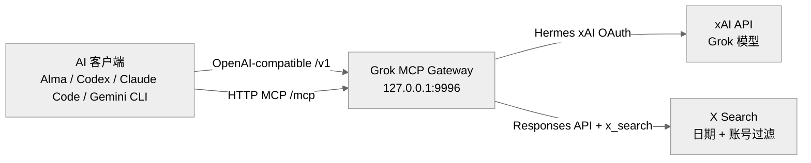

<p align="center">
  <a href="https://github.com/logicrw/grok-mcp-gateway">GitHub</a> ·
  <a href="#快速开始">快速开始</a> ·
  <a href="#mcp-x-search">MCP X Search</a> ·
  <a href="#无头服务器部署">无头服务器部署</a>
</p>

<p align="center">
  <a href="./README.md">English</a> ·
  <a href="./README.zh-CN.md">简体中文</a>
</p>

<p align="center">
  <strong>面向多 Agent 客户端的本地 Grok 与 X Search Gateway。</strong>
</p>

Grok MCP Gateway 会把 Hermes Agent 里的 xAI OAuth 会话变成本地 gateway，
让 AI 客户端用两种方式接入：

1. **模型接入：** 通过 OpenAI-compatible API 调用 Grok，不需要单独的
   xAI API key。
2. **工具接入：** 把 xAI `x_search` 暴露成常驻 HTTP MCP 工具，让非 Grok
   模型也能通过客户端工具层搜索 X。

这个 fork 最大的不同点是：Alma、Claude Code 风格客户端、Antigravity、
Codex、Gemini CLI、LiteLLM，以及其他本地 Agent 工作流，可以共享同一个
proxy 进程，同时获得 Grok 模型调用和 MCP X Search 能力。

> 原始出处：本项目基于
> [yelixir-dev/grok-oauth-proxy](https://github.com/yelixir-dev/grok-oauth-proxy)。
> 上游项目提供 Grok OAuth proxy 和无头 OAuth 转移流程；这个 fork 增加了
> 常驻 HTTP MCP `x_search` gateway，以及面向本地多 Agent 客户端的配置。

## 解决什么问题

Hermes Agent 可以通过 OAuth 授权 xAI Grok 和 X Premium/Premium+。这解决
了凭据问题，但大多数本地 AI 客户端还需要：

- 一个 OpenAI-compatible base URL，用来选择 Grok 模型；
- 一个工具接口，让当前模型是 Claude、GPT、Gemini 或其他非 Grok 模型时，
  仍然可以请求 X Search；
- 一个可被多个本地 Agent 共用的常驻进程；
- 独立 token 状态，避免 proxy 和 Hermes 同时刷新同一个 OAuth 文件。

Grok MCP Gateway 提供的就是这一层。

关键边界：非 Grok 模型不是“原生会搜索 X”。它们所在的客户端调用这个
proxy 暴露的 MCP `x_search` 工具，再由 proxy 使用你的本地 OAuth 会话
通过 xAI 完成搜索。

## 和官方 X MCP 的关系

[X 官方 MCP 文档](https://docs.x.com/tools/mcp) 描述的是两套不同接口：用于
X API 操作的 X API MCP server，以及用于查询文档的 X Docs MCP server。Grok
MCP Gateway 更窄：它保留 Hermes/xAI OAuth 的 Grok 模型 gateway，并通过 xAI
Responses API 暴露聚焦的 X Search MCP 工具。

如果你需要更完整的 X API 操作，例如账号或发帖工作流，可以把官方 X MCP 和本
项目同时运行。本项目的定位是本地 Grok 模型接入，以及让非 Grok Agent 通过
MCP 工具层调用 OAuth-backed X Search。

## 是什么 / 不是什么

这个项目是：

- 一个本地 OpenAI-compatible Grok gateway，通过 Hermes 派生的 xAI OAuth
  调用 Grok 模型；
- 一个常驻 HTTP MCP server，暴露聚焦的 X Search 工具；
- 一个可被 Alma、Codex、Claude Code、Gemini CLI、Antigravity、LiteLLM
  等本地 Agent 客户端共享的进程。

这个项目不是：

- 通用 MCP router、MCP marketplace，或远程工具聚合器；
- 官方 X API MCP server 的替代品。如果你需要发帖、账号管理或更完整的 X API
  操作，应同时运行官方 X MCP；
- Node.js、npm、Express、Docker 或 Heroku 模板；
- 让所有模型“原生懂 X”的魔法。非 Grok 模型只有在客户端主动调用 MCP 工具时
  才能搜索 X。

## 核心能力

**Grok 模型 gateway**

用 Hermes 派生的 OAuth，把 OpenAI-compatible 请求转发到 xAI。

**常驻 HTTP MCP X Search**

在 `/mcp` 暴露共享的 `x_search` 工具，供 Alma 和其他 MCP 客户端使用。

**非 Grok 模型间接使用 X Search**

只要客户端支持 MCP，Claude、GPT、Gemini 等模型也可以通过工具调用搜索 X。

**独立 token 生命周期**

从 Hermes 复制 xAI OAuth 到 proxy 自己的 token state，并独立刷新。

**兼容 Hermes auth 形态**

支持两种 Hermes auth 结构：`providers.xai-oauth` 和
`credential_pool.xai-oauth`。

**适合无头部署**

只导出 xAI OAuth 凭据到服务器，可用 systemd 或 macOS LaunchAgent 常驻。

**生产运行防护**

默认只绑定 loopback；非 loopback 必须设置 `PROXY_API_KEY`；token 文件私有
权限；转发前清理敏感 header；提供 deep health check 和 Prometheus metrics。

## 快速开始

### 1. 前置条件

- Python 3.9+
- 已安装 Hermes Agent
- Hermes Agent 已完成 xAI Grok OAuth 授权
- xAI/X 订阅或权益允许你使用目标 Grok / X Search 能力
- 如果要让非 Grok 模型使用 X Search：客户端需要支持 HTTP MCP server

检查 Hermes 是否已有 xAI OAuth：

```bash
python -c 'import json, pathlib; data=json.load(open(pathlib.Path.home()/".hermes/auth.json")); print("xai-oauth present:", "xai-oauth" in data.get("providers", {}) or bool(data.get("credential_pool", {}).get("xai-oauth")))'
```

如果输出是 `False`，先回 Hermes Agent 完成 xAI Grok OAuth 登录。

### 2. 安装

```bash
git clone https://github.com/logicrw/grok-mcp-gateway.git
cd grok-mcp-gateway
./install.sh
```

### 3. 启动

```bash
source .venv/bin/activate
python main.py
```

默认地址：

```text
http://127.0.0.1:9996
```

如果 `9996` 被占用，程序会向上寻找可用端口。

### 4. Smoke Test

```bash
curl -sS http://127.0.0.1:9996/health
```

```bash
curl -sS http://127.0.0.1:9996/health?deep=1
```

```bash
curl -sS http://127.0.0.1:9996/v1/chat/completions \
  -H "Content-Type: application/json" \
  -d '{
    "model": "grok-4.3",
    "messages": [{"role": "user", "content": "Reply with one short sentence."}]
  }'
```

## 配置 AI 客户端

### Alma Custom Provider

当你希望 Alma 把 Grok 当成模型调用时，添加 custom provider：

```text
Provider Name: Grok MCP Gateway
Base URL:      http://127.0.0.1:9996/v1
API Key:       dummy
API Format:    Chat Completions (/chat/completions)
```

说明：

- 如果 Alma 要求 API key，可以填任意非空占位符。
- proxy 会在转发前移除客户端传来的 `Authorization`，再注入自己的 xAI
  OAuth bearer token。
- 如果客户端会自动追加 `/v1`，就填 `http://127.0.0.1:9996`，不要重复写
  `/v1`。

### Alma MCP Server

当你希望 Alma Agent，包括非 Grok 模型，通过 MCP 调用 X Search 时，添加：

```json
{
  "mcpServers": {
    "x_search": {
      "url": "http://127.0.0.1:9996/mcp"
    }
  }
}
```

模型 provider 和 MCP server 是两套配置。如果你既要 Alma 调 Grok，又要
Agent 使用 X Search 工具，两者都要配置。

### LiteLLM

```yaml
model_list:
  - model_name: grok-4.3
    litellm_params:
      model: openai/grok-4.3
      api_base: http://127.0.0.1:9996/v1
      api_key: dummy
```

### OpenAI Python SDK

```python
from openai import OpenAI

client = OpenAI(
    base_url="http://127.0.0.1:9996/v1",
    api_key="dummy",
)

response = client.chat.completions.create(
    model="grok-4.3",
    messages=[{"role": "user", "content": "Say hello in one sentence."}],
)
print(response.choices[0].message.content)
```

## MCP X Search

常驻 HTTP MCP endpoint：

```text
POST http://127.0.0.1:9996/mcp
```

默认暴露两个工具：

- `x_search`：用于开放式 X 搜索和话题发现。
- `x_latest_posts`：用于按账号抽取最新帖子。查某个账号最近发了什么时，优先用
  这个工具，避免把帖子原文误改写成主题摘要。

### `x_search`

| 参数 | 类型 | 必填 | 说明 |
| --- | --- | --- | --- |
| `query` | string | 是 | 自然语言搜索请求。建议写清主题、账号、时间范围和输出格式。 |
| `allowed_x_handles` | string array | 否 | 限定搜索账号，例如 `["elonmusk", "xai"]`。 |
| `excluded_x_handles` | string array | 否 | 排除指定账号。不能和 `allowed_x_handles` 同时使用。 |
| `from_date` | string | 否 | ISO8601 搜索起始日期，例如 `2026-05-18`。 |
| `to_date` | string | 否 | 包含当天的 ISO8601 搜索结束日期，例如 `2026-05-18`。date-only 值会由 proxy 适配 xAI 当前日期边界行为。 |
| `enable_image_understanding` | boolean | 否 | 支持时让 xAI 使用图片理解。 |
| `enable_video_understanding` | boolean | 否 | 支持时让 xAI 使用视频理解。 |
| `model` | string | 否 | MCP 调用使用的 xAI 模型，默认是 `GROK_PROXY_MCP_MODEL` 或 `grok-4.3`。 |
| `raw` | boolean | 否 | 返回压缩后的原始 xAI JSON，而不是抽取后的文本。 |

### `x_latest_posts`

这个工具底层仍然使用 xAI `x_search`。它不是官方 X API timeline，但给 MCP
客户端提供了更严格的账号最新帖工具契约。

| 参数 | 类型 | 必填 | 说明 |
| --- | --- | --- | --- |
| `handle` | string | 是 | 单个 X 账号，可带或不带 `@`，例如 `0xlogicrw`。 |
| `count` | integer | 否 | 目标返回帖子数，默认 `10`，最大 `20`。 |
| `lookback_days` | integer | 否 | 未设置 `from_date` 时的默认回看窗口，默认 `30` 天。 |
| `from_date` | string | 否 | ISO8601 搜索起始日期，会覆盖 `lookback_days`。 |
| `to_date` | string | 否 | 包含当天的 ISO8601 搜索结束日期，默认今天。 |
| `include_replies` | boolean | 否 | xAI 能找到时是否允许包含回复，默认 `true`。 |
| `model` | string | 否 | MCP 调用使用的 xAI 模型，默认是 `GROK_PROXY_MCP_MODEL` 或 `grok-4.3`。 |

列出工具：

```bash
curl -sS http://127.0.0.1:9996/mcp \
  -H "Content-Type: application/json" \
  --data '{"jsonrpc":"2.0","id":1,"method":"tools/list","params":{}}'
```

调用 X Search：

```bash
curl -sS http://127.0.0.1:9996/mcp \
  -H "Content-Type: application/json" \
  --data '{
    "jsonrpc": "2.0",
    "id": 2,
    "method": "tools/call",
    "params": {
      "name": "x_search",
      "arguments": {
        "query": "Search recent X posts from @xai about Hermes Agent. Reply in one short sentence.",
        "allowed_x_handles": ["xai"],
        "from_date": "2026-05-18",
        "to_date": "2026-05-18"
      }
    }
  }'
```

调用账号最新帖抽取：

```bash
curl -sS http://127.0.0.1:9996/mcp \
  -H "Content-Type: application/json" \
  --data '{
    "jsonrpc": "2.0",
    "id": 3,
    "method": "tools/call",
    "params": {
      "name": "x_latest_posts",
      "arguments": {
        "handle": "0xlogicrw",
        "count": 10,
        "lookback_days": 30
      }
    }
  }'
```

## 可选 Auto X Search Shim

有些客户端能调用 `/v1/responses`，但 UI 里不能挂 xAI server-side tools。
这种情况下，proxy 可以自动把 `x_search` 注入 Responses API 请求。

默认关闭：

```bash
GROK_PROXY_AUTO_X_SEARCH=true python main.py
```

可选限制：

```bash
GROK_PROXY_AUTO_X_SEARCH=true \
GROK_PROXY_X_SEARCH_ALLOWED_HANDLES=xai,elonmusk \
GROK_PROXY_X_SEARCH_IMAGE_UNDERSTANDING=true \
python main.py
```

能用 MCP 时优先用 MCP。MCP 的工具调用是显式的，更容易调试。Auto shim 只是
兼容 fallback。

## 无头服务器部署

可靠的无头部署建议把桌面 Hermes 的 token chain 和服务器 proxy 的 token
chain 分开。

推荐 split-chain 流程：

```text
1. 在本机通过浏览器完成 Hermes xAI OAuth。
2. 只导出 xAI OAuth 凭据。
3. 在无头 proxy 服务器导入这份凭据。
4. 回到本机重新授权 Hermes，让 Hermes 和 proxy 各自拥有独立 refresh-token chain。
```

服务器安装：

```bash
git clone https://github.com/logicrw/grok-mcp-gateway.git
cd grok-mcp-gateway
./install.sh --headless
```

安装并启用 systemd：

```bash
./install.sh --headless --enable-service
```

在有浏览器的机器上导出 xAI OAuth：

```bash
cd grok-mcp-gateway
python scripts/export_xai_oauth.py > ~/xai-oauth.json
```

在服务器导入：

```bash
scp ~/xai-oauth.json user@example.com:/tmp/xai-oauth.json
python scripts/import_xai_oauth.py /tmp/xai-oauth.json
rm -f /tmp/xai-oauth.json
chmod 700 ~/.hermes
chmod 600 ~/.hermes/auth.json
sudo systemctl restart grok-mcp-gateway
```

一键刷新远程服务器：

```bash
python scripts/refresh_remote_xai_oauth.py \
  --host user@example.com \
  --identity ~/.ssh/id_ed25519 \
  --print-reauth-command
```

导出的文件含 refresh token。把它当密码处理，不要提交，导入后删除。

## 常驻运行

### macOS LaunchAgent

macOS service 说明在 [services/service-examples.md](services/service-examples.md)。

代码或环境变量变化后：

```bash
launchctl kickstart -k gui/$(id -u)/io.logicrw.grok-mcp-gateway
```

### systemd

示例 unit：

```ini
[Unit]
Description=Grok MCP Gateway for Hermes
After=network.target

[Service]
Type=simple
User=youruser
WorkingDirectory=/home/youruser/grok-mcp-gateway
Environment=HOME=/home/youruser
Environment=HERMES_AUTH_PATH=/home/youruser/.hermes/auth.json
Environment=PATH=/home/youruser/grok-mcp-gateway/.venv/bin:/home/youruser/.local/bin:/usr/local/bin:/usr/bin:/bin
ExecStart=/home/youruser/grok-mcp-gateway/.venv/bin/python main.py
Restart=always
RestartSec=5

[Install]
WantedBy=multi-user.target
```

```bash
sudo systemctl daemon-reload
sudo systemctl enable --now grok-mcp-gateway
```

## 配置项

| 变量 | 默认值 | 说明 |
| --- | --- | --- |
| `PROXY_HOST` | `127.0.0.1` | 绑定地址。非 loopback 必须设置 `PROXY_API_KEY`。 |
| `PROXY_PORT` | `9996` | 起始端口。被占用时向上寻找。 |
| `PROXY_API_KEY` | 未设置 | 可选本地 proxy auth key。非 loopback 必须设置。支持 `Authorization: Bearer <key>` 或 `X-Proxy-Api-Key: <key>`。 |
| `GROK_PROXY_AUTH_STATE` | `~/.local/state/grok-oauth-proxy/auth_state.json` | proxy 自己的 OAuth token state。 |
| `HERMES_AUTH_PATH` | `~/.hermes/auth.json` | Hermes auth 文件。 |
| `LOG_LEVEL` | `INFO` | Python app 日志级别。 |
| `TOKEN_REFRESH_WINDOW` | `300` | token 到期前多少秒触发后台刷新。 |
| `HERMES_POLL_INTERVAL` | `60` | Hermes auth 文件轮询间隔。 |
| `UPSTREAM_RETRY_ATTEMPTS` | `2` | 幂等 upstream 请求和瞬时连接错误的重试次数。 |
| `UPSTREAM_RETRY_DELAY` | `1.0` | upstream 重试基础间隔。 |
| `GROK_PROXY_MCP_MODEL` | `grok-4.3` | MCP `x_search` 默认使用的 xAI 模型。 |
| `GROK_GATEWAY_MCP_TOOL_ALLOWLIST` | `x_search,x_latest_posts` | MCP 工具 allowlist，逗号分隔。新增或暴露更多工具前应显式配置。 |
| `GROK_PROXY_MCP_X_SEARCH_CONCURRENCY` | `3` | MCP `x_search` 最大并发调用数。 |
| `GROK_PROXY_AUTO_X_SEARCH` | `false` | 是否向 `/v1/responses` 请求注入 xAI `x_search`。 |
| `GROK_PROXY_X_SEARCH_ALLOWED_HANDLES` | 未设置 | Auto-injected X Search 的账号 allowlist，逗号分隔。 |
| `GROK_PROXY_X_SEARCH_IMAGE_UNDERSTANDING` | `false` | Auto-injected X Search 是否启用图片理解。 |
| `GROK_PROXY_X_SEARCH_VIDEO_UNDERSTANDING` | `false` | Auto-injected X Search 是否启用视频理解。 |

`GROK_PROXY_*` 环境变量前缀和默认 token state 路径会继续保留，用来兼容早期
安装。

## 本地端点

| Endpoint | Method | 说明 |
| --- | --- | --- |
| `/health` | `GET` | 本地状态和 token 到期时间。 |
| `/health?deep=1` | `GET` | 本地状态 + 真实 upstream `/v1/models` 检查。 |
| `/metrics` | `GET` | Prometheus-compatible metrics。 |
| `/mcp` | `POST` | HTTP JSON-RPC MCP endpoint，暴露 `x_search`。 |
| `/{path:path}` | any | 转发到 `https://api.x.ai/{path}`。 |

## 安全说明

- 除非明确需要暴露服务，否则保持绑定 `127.0.0.1`。
- 如果绑定 `0.0.0.0` 或其他非 loopback 地址，必须设置 `PROXY_API_KEY`，
  跨机器使用时还应放在 TLS/authentication 后面。
- 不要提交 `auth_state.json`、`.hermes/auth.json`、导出的 `xai-oauth.json`、
  包含 bearer token 的日志，或写入真实凭据的 service 文件。
- proxy 转发到 xAI 前会移除传入的 `Authorization`、`Proxy-Authorization`、
  cookie、hop-by-hop headers 和可伪造 forwarding headers。
- 默认关闭 Uvicorn access logs，减少 query string 泄漏。
- proxy 创建的本地 token 文件使用私有权限。
- 本项目复用 Hermes 在 xAI Grok OAuth 登录中取得的 OAuth client identity。
  请自行判断它和 xAI 条款、账号规则之间的关系。

## 排障

### Alma 能用 Grok，但不能用 X Search

单独配置 MCP server：

```json
{
  "mcpServers": {
    "x_search": {
      "url": "http://127.0.0.1:9996/mcp"
    }
  }
}
```

### MCP 能列出工具，但调用失败

```bash
curl -sS http://127.0.0.1:9996/health?deep=1
curl -sS http://127.0.0.1:9996/metrics | rg mcp_x_search
```

常见原因：

- `GROK_GATEWAY_MCP_TOOL_ALLOWLIST` 没有包含 `x_search`。
- xAI OAuth 需要重新在 Hermes 授权。
- 当前账号没有目标模型或 X Search 权益。
- `allowed_x_handles` 限制太窄。
- 客户端用 GET 调 `/mcp`，而不是 POST。

### Base URL 混淆

客户端需要 OpenAI base URL 时，用 `http://127.0.0.1:9996/v1`。
客户端会自己追加 `/v1` 时，用 `http://127.0.0.1:9996`。

## 开发

```bash
python -m venv .venv
source .venv/bin/activate
pip install -r requirements-dev.txt
pytest -q
```

发布前常用检查：

```bash
git diff --check
pytest -q
rg -n "(ghp_|sk-[A-Za-z0-9_-]{20,}|xox[baprs]-|Bearer [A-Za-z0-9._-]{20,})" . -g '!README.md' -g '!README.zh-CN.md' -g '!*.pyc' -g '!__pycache__/**'
```

## License

MIT
