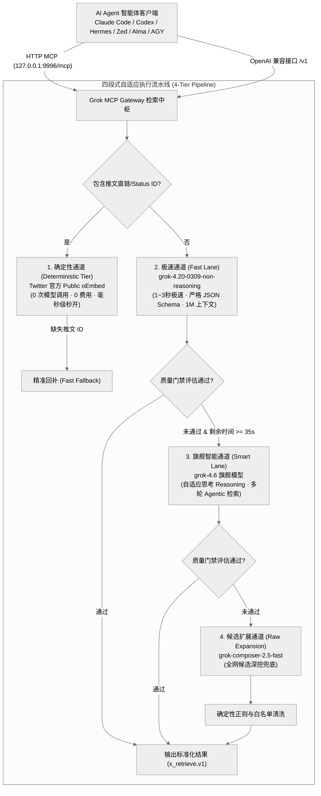

# Grok MCP Gateway

> **企业级、四段式自适应 X/Twitter 智能检索网关与 Model Context Protocol (MCP) 服务，基于 xAI 前沿大模型驱动。**

`grok-mcp-gateway` 为你本地的所有 AI 代码与智能体客户端（Claude Code、Cursor、Codex、Hermes、Zed、Alma、Antigravity 等）提供高性能、统一的推文检索中枢。它将复杂的模型选型、速率限制、OAuth 轮换与请求延迟封装在一个整洁、确定性的标准工具背后：**`x_retrieve`**。


```mermaid
---
config:
  theme: neutral
---
flowchart TD
    Clients["AI Agent 智能体客户端<br/>Claude Code / Codex / Hermes / Zed / Alma / AGY"] -->|"HTTP MCP (127.0.0.1:9996/mcp)"| Gateway["Grok MCP Gateway 检索中枢"]
    Clients -->|"OpenAI 兼容接口 /v1"| Gateway

    subgraph Pipeline ["四段式自适应执行流水线 (4-Tier Pipeline)"]
        direction TB
        Gateway --> Check{"包含推文直链/Status ID?"}
        Check -- "是" --> Deterministic["1. 确定性通道 (Deterministic Tier)<br/>Twitter 官方 Public oEmbed<br/>(0 次模型调用 · 0 费用 · 毫秒级秒开)"]
        Check -- "否" --> Fast["2. 极速通道 (Fast Lane)<br/>grok-4.20-0309-non-reasoning<br/>(1~3秒极速 · 严格 JSON Schema · 1M 上下文)"]
        Deterministic -- "缺失推文 ID" --> FastFallback["精准回补 (Fast Fallback)"]
        Fast --> QualityGate{"质量门禁评估通过?"}
        QualityGate -- "通过" --> Output["输出标准化结果 (x_retrieve.v1)"]
        QualityGate -- "未通过 & 剩余时间 >= 35s" --> Smart["3. 旗舰智能通道 (Smart Lane)<br/>grok-4.6 旗舰模型<br/>(自适应思考 Reasoning · 多轮 Agentic 检索)"]
        Smart --> SmartQuality{"质量门禁评估通过?"}
        SmartQuality -- "通过" --> Output
        SmartQuality -- "未通过" --> Raw["4. 候选扩展通道 (Raw Expansion)<br/>grok-composer-2.5-fast<br/>(全网候选深挖兜底)"]
        Raw --> Filter["确定性正则与白名单清洗"] --> Output
    end
```

<p align="center">
  <a href="./README.md">English</a> ·
  <a href="./README.zh-CN.md">简体中文</a> ·
  <a href="#核心架构亮点">核心架构</a> ·
  <a href="#快速上手">快速上手</a> ·
  <a href="#配置各-ai-客户端">客户端配置</a> ·
  <a href="#配置说明">配置说明</a>
</p>

---

## 核心架构亮点

### 1. 四段式自适应执行流水线
网关摒弃了将所有请求无脑发给昂贵推理模型的做法，根据任务特征在四个专门通道间智能分流：

1. **确定性通道（Twitter 官方 Public oEmbed 优先）**：
   - 当用户查询包含具体的推文 URL 或 15~20 位数字推文 ID 时，优先并发请求 Twitter 官方 oEmbed 接口。
   - 只要成功解析出推文原文，**模型调用次数直接降为 0**（0 成本、毫秒级响应、100% 官方推文保真）。
2. **极速通道（Fast Lane: `grok-4.20-0309-non-reasoning`）**：
   - 承接作者最新动态（`latest_by_handle`）与简单推文列表查询。
   - 基于 xAI 非思考架构：**1~3 秒极速响应**、1M 超大上下文、零 Thinking 延迟、成本极低。
3. **旗舰智能通道（Smart Lane: `grok-4.6` 旗舰模型）**：
   - 专门用于复杂语义调研、深度信源挖掘、社交舆论追踪与事实核查（`claim_verification`）。
   - 自适应挂载合规的推理档位（`low` / `medium` / `high` / `xhigh`）与多轮 Agentic `x_search` 工具链。
4. **候选扩展通道（Raw Expansion Lane: `grok-composer-2.5-fast`）**：
   - 针对冷门、生僻话题的高吞吐候选深挖源。非结构化文本在进入结果前必须经过严格的确定性正则与 URL 白名单清洗。

### 2. 自动化质量门禁与无感自愈升级
- **实时质量评估**：实时校验返回条数（对比 `min_items`）、status URL 合法性以及推文正文完整度。
- **预算感知无感升级**：当 Fast Lane 抓取结果不足或质量未达标时，只要请求剩余时间充足（$\ge 35\text{s}$），网关会**自动静默升级到 Grok 4.6 旗舰模型重新检索**，调用方完全无感知。

### 3. 多 Agent 并发单飞 Token 刷新（Single-Flight Coalescing）
- 专为多 Agent 开发者工作区设计。
- 当多个 Agent（如 Claude Code + Codex + Hermes）在 Token 过期时同时发起请求，所有并发 401 会自动在内存锁内合并——**有且仅触发 1 次上游 OAuth 刷新**，彻底杜绝多端竞争导致的 Token 轮换失效。

### 4. 原生结构化输出与轮数治理
- 直接在 xAI Responses API 层面施加严格的 JSON Schema 校验（`text.format.json_schema`, `strict: true`）。
- 严格限制各阶段工具迭代轮数（Fast 限制 2 轮，Smart 限制 3 轮）并显式声明 `store: false`，杜绝死循环与额外扣费。

### 5. 生产级 Prometheus 可观测性
- 内置 `/metrics` 度量接口，提供低基数监控：
  - 最终检索状态（`ok`、`empty`、`no_match`、`degraded`、`error`）
  - 各阶段执行耗时与超时边界
  - 上游 Token 消耗、Reasoning 思考 Token 数量与 X Search 工具调用次数
  - 从上游实时解析的美金计费 Ticks（`cost_in_usd_ticks`）

---

## 快速上手

### 1. 本地安装

```bash
git clone https://github.com/logicrw/grok-mcp-gateway.git
cd grok-mcp-gateway
python3 -m venv .venv
source .venv/bin/activate
pip install -r requirements.txt
```

### 2. 启动服务

```bash
# 启动本地常驻网关（默认端口 9996）
python main.py
```

健康检查：
```bash
curl -sS http://127.0.0.1:9996/health
# {"status":"ok","provider":"xai-oauth","mcp":{"enabled_tools":["x_retrieve"]...}}
```

### 3. 配置为后台常驻服务（macOS LaunchAgent）

在 macOS 上作为后台守护进程常驻运行：

```bash
cp services/io.logicrw.grok-mcp-gateway.plist ~/Library/LaunchAgents/
launchctl load ~/Library/LaunchAgents/io.logicrw.grok-mcp-gateway.plist
```

---

## 配置各 AI 客户端

本地统一 HTTP MCP 端点：
```text
http://127.0.0.1:9996/mcp
```

### Claude Code (`~/.claude.json`)
```json
{
  "mcpServers": {
    "grok_mcp_gateway": {
      "url": "http://127.0.0.1:9996/mcp"
    }
  }
}
```

### Codex (`~/.codex/config.toml`)
```toml
[mcp_servers.grok_mcp_gateway]
url = "http://127.0.0.1:9996/mcp"
```

### Hermes (`~/.hermes/config.yaml`)
```yaml
mcp_servers:
  grok_mcp_gateway:
    url: "http://127.0.0.1:9996/mcp"
```

### LiteLLM (`config.yaml`)
```yaml
model_list:
  - model_name: grok-4.6
    litellm_params:
      model: openai/grok-4.6
      api_base: http://127.0.0.1:9996/v1
      api_key: dummy
```

### OpenAI Python SDK
```python
from openai import OpenAI

client = OpenAI(base_url="http://127.0.0.1:9996/v1", api_key="dummy")
response = client.chat.completions.create(
    model="grok-4.6",
    messages=[{"role": "user", "content": "你好 Grok！"}],
)
print(response.choices[0].message.content)
```

---

## MCP 工具参考: `x_retrieve`

`x_retrieve` 是网关对外暴露的唯一公共检索工具。

### 参数说明

| 参数 | 类型 | 必填 | 说明 |
| :--- | :--- | :---: | :--- |
| `query` | string | 可选* | 自然语言话题、断言、信源线索、OCR 提取文本或推文 URL/ID（*若已提供 `handles` + `sort=latest` 则该字段可选）。 |
| `intent` | string | 可选 | `auto`、`research`、`posts`、`source_discovery`、`reaction_tracking` 或 `verify_claim`。默认为 `auto`。 |
| `handles` | array | 可选 | 作者 handle 列表（如 `["@xai", "@elonmusk"]`）。 |
| `excluded_handles` | array | 可选 | 需要排除的 handle 列表。 |
| `time_range` | string | 可选 | 自然语言时间窗口（如 `最近30天`、`2026年8月`、`上周`）。 |
| `from_date` | string | 可选 | 搜索起始日期（ISO8601，如 `2026-08-01`）。 |
| `to_date` | string | 可选 | 搜索结束日期（ISO8601，如 `2026-08-15`）。 |
| `count` | integer | 可选 | 期望返回推文数量（默认 `10`，上限 `20`）。 |
| `sort` | string | 可选 | `latest` 或 `relevance`（query 检索默认 `relevance`；纯 handles 检索默认 `latest`）。 |
| `quality` | object | 可选 | 自定义质量门禁：`min_items`、`require_status_url`、`require_original_text`。 |
| `model_policy` | string | 可选 | `auto`、`stable_only` 或 `raw_expanded`。 |
| `model` | string | 可选 | 显式指定模型覆盖（如 `grok-4.6`、`grok-4.5`）。 |

### 智能体典型查询场景

- **作者动态查询**：`{"handles": ["@xai"], "sort": "latest", "count": 5}`  
  *(自动路由至 Fast Lane：1~3 秒极速返回)*
- **深度话题调研**：`{"query": "Grok 4.6 架构升级与基准评测", "intent": "research"}`  
  *(自动路由至 Smart Lane：Grok 4.6 + medium 推理)*
- **推文直链解析**：`{"query": "https://x.com/xai/status/2087630662631100586"}`  
  *(自动路由至确定性 oEmbed：0 模型调用，毫秒级保真返回)*
- **事实与断言核查**：`{"query": "xAI 是否在8月12日正式发布了 Grok 4.6？", "intent": "verify_claim"}`  
  *(自动路由至 Smart Lane：high 推理档位严格求证)*

---

## 配置说明

所有网关参数均可通过环境变量或 `.env` 进行自定义：

| 环境变量 | 默认值 | 说明 |
| :--- | :---: | :--- |
| `GROK_PROXY_RETRIEVE_MODEL` | `grok-4.6` | Smart Tier 旗舰模型。 |
| `GROK_PROXY_FAST_MODEL` | `grok-4.20-0309-non-reasoning` | Fast Lane 极速非推理模型。 |
| `GROK_PROXY_RETRIEVE_RAW_MODEL` | `grok-composer-2.5-fast` | Raw Expansion 候选深挖兜底模型。 |
| `GROK_PROXY_ENABLE_AUTO_TIERING` | `true` | 是否启用四段式自适应分流与质量门禁升级。 |
| `GROK_PROXY_FAST_STAGE_TIMEOUT_SECONDS` | `15.0` | Fast Lane 阶段超时上限。 |
| `GROK_PROXY_SMART_STAGE_TIMEOUT_SECONDS` | `60.0` | Smart Lane 阶段超时上限。 |
| `GROK_PROXY_SMART_ESCALATION_MIN_REMAINING_SECONDS` | `35.0` | 触发 Smart 升级所需的最低剩余时间预算。 |
| `GROK_PROXY_RETRIEVE_TOTAL_TIMEOUT_SECONDS` | `120.0` | 单次 `x_retrieve` 总执行超时上限。 |
| `GROK_PROXY_FAST_MAX_TURNS` | `2` | Fast Lane 单次请求最大工具调用轮数。 |
| `GROK_PROXY_SMART_MAX_TURNS` | `3` | Smart Lane 单次请求最大工具调用轮数。 |
| `GROK_PROXY_MCP_X_SEARCH_CONCURRENCY` | `3` | 上游 xAI 请求的并发信号量上限。 |

---

## 安全与隐私保护

- **零提示词与正文落盘**：网关绝不将用户的 prompt、推文正文或 OAuth Token 写入磁盘日志或 Prometheus 指标。
- **严格文件权限保护**：OAuth Token 状态存储（`~/.local/state/grok-oauth-proxy/`）强制执行 POSIX `0700` 目录与 `0600` 文件只读权限。
- **完全解耦的状态管理**：网关独立维护自身的刷新凭据，绝不反向修改或污染外部客户端的私有配置文件。

---

## 开源协议

MIT License.
