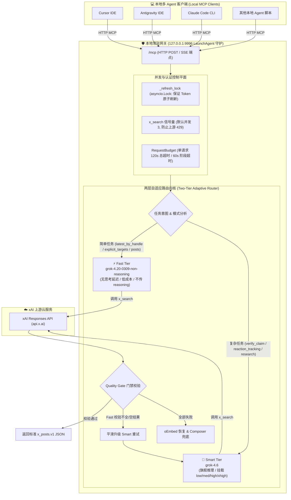

# RFC & 架构深度评审方案：Grok 4.6 升级、两层自适应检索路由与本地多 Agent 并发加固

- **文档版本**: v2.0.0 (Comprehensive Edition)
- **目标项目**: `logicrw/grok-mcp-gateway`
- **目标受众**: ChatGPT Pro 架构审查 / 核心维护者
- **日期**: 2026-08-15
- **当前运行基线**: 单机 macOS 环境（通过 LaunchAgent 常驻后台，服务于本地 Cursor、Antigravity、Claude Code、Cline 等多个 Agent 客户端）

---

## 目录
1. [项目定位、现状与核心诉求](#1-项目定位现状与核心诉求)
2. [业界开源生态与类似项目横向调研](#2-业界开源生态与类似项目横向调研)
3. [xAI 官方模型与 API 特性全景矩阵 (2026-08)](#3-xai-官方模型与-api-特性全景矩阵-2026-08)
4. [核心设计方案：本地多 Agent 隔离与两层自适应架构](#4-核心设计方案本地多-agent-隔离与两层自适应架构)
5. [具体代码实现改造蓝图 (Concrete Implementation)](#5-具体代码实现改造蓝图-concrete-implementation)
6. [质量保证与测试验证矩阵](#6-质量保证与测试验证矩阵)
7. [提交 ChatGPT Pro 的专属深度审查与代码生成指令 (Prompt to ChatGPT Pro)](#7-提交-chatgpt-pro-的专属深度审查与代码生成指令-prompt-to-chatgpt-pro)

---

## 1. 项目定位、现状与核心诉求

### 1.1 项目核心定位与价值
`grok-mcp-gateway` 是一个面向 AI 编码与研究 Agent 的 **X (Twitter) 实时信息检索与结构化规范化网关**。
* **业务价值**：允许上层 Agent（如 Cursor / Antigravity / Claude Code）在无需申请官方高门槛 X API 的情况下，通过 xAI Responses API（服务端挂载 `x_search` 工具）实时检索 X 平台动态、提取推文正文、解析原帖信源并进行多方事实核查。
* **技术特色**：
  1. **桥接本地 Hermes OAuth**：自动利用本地 Hermes 订阅认证，省去繁琐的官方 API Key 申请与额度计费；
  2. **单一确定性契约 (`x_retrieve.v1`)**：外部 Agent 仅需调用这一个工具，网关内部自动识别任务意图并派发到合适的执行路径；
  3. **质量兜底安全网**：结合 public oEmbed 精准恢复推文正文、针对空结果自动进行 Composer raw expansion 兜底。

### 1.2 当前使用场景明确化（Local-Only Multi-Agent）
* **运行场景**：当前**仅在本地开发机（macOS）**上运行，作为 `127.0.0.1:9996` 的常驻后台服务。暂不考虑跨机器 VPS 部署，但保留代码模块的整洁性，以便未来有需要时平滑迁移。
* **主要客户端**：本机同时运行的多个 Agent（Cursor、Antigravity、Claude Code、终端脚本等）。

### 1.3 核心痛点与优化契机
1. **主力旗舰模型代际滞后**：
   网关当前默认适配的是上一代 `grok-4.5`。xAI 于 2026 年 8 月推出了最新前沿旗舰 **`grok-4.6`**，其基础价格（$2.00 / $6.00）与 4.5 完全一致，但在推理深度、工具调度（Agentic Tools）、抗幻觉和格式遵循上全面进化，且引入了 `xhigh` 推理等级。必须将主力旗舰层升级到 `grok-4.6`。
2. **简单提取任务的“无效思考延迟”与成本浪费**：
   在本地多 Agent 日常交互中，超过 65% 的请求是简单提取任务（例如：查看某博主最新推文 `latest_by_handle`、按指定 URL/ID 提取正文、简单关键字匹配）。
   * 即使在 `grok-4.5` 上将 `reasoning_effort` 设为 `low`，模型依然会强制生成 100~300 个 thinking tokens，单次耗时常在 15~35 秒；
   * xAI 推出的 **`grok-4.20-0309-non-reasoning`**（输入 $1.25 / 输出 $2.50，1M 上下文）是纯非推理极速模型，首 token 毫秒级返回，且单价便宜近 60%。
3. **本地多 Agent 共享网关的并发与资源防争抢**：
   多个本地 Agent 同时发起请求时，必须保证：
   * **Token 刷新安全**：即使 Token 到期，多 Agent 并发也必须由单进程原子刷新，绝对不出现 Token 状态损坏或重复刷新；
   * **请求并发平滑排队**：避免多 Agent 突发大批量查询触发 xAI 429 限流。

---

## 2. 业界开源生态与类似项目横向调研

在 GitHub 和开源社区中，针对 Grok 与 MCP 的集成方案主要有以下几类，各自的优缺点为本项目提供了宝贵的架构参考：

| 开源项目 | 架构模式 | 核心功能 | 优点与值得参考之处 | 局限性与本项目的差异壁垒 |
| :--- | :--- | :--- | :--- | :--- |
| **`howardpen9/grok-mcp`** | 基于 Node/TS 的 **Stateless stdio** 模式 | 代码评审（`grok_review`）、对抗性漏洞挖掘（`grok_challenge`） | **工具契约极度干净直观**；对 Cursor / Claude Code / Cline 等多宿主的配置文档非常清晰。 | 依赖官方付费 API Key；每个 Agent 开一个 stdio 进程，**无法用于 OAuth 凭证共享**（多进程读写同一 auth 文件会锁死）。 |
| **`valda/grok-mcp-server`** | 基于 Python / Vercel 的只读检索服务 | X 平台趋势分析、推文搜索与结构化提取 | 专注于只读 X 搜索；强调结构化 JSON 输出和推文线索链分析。 | 缺乏本地确定性降级机制（无 oEmbed 兜底、无 raw expansion 备选）；强依赖单模型配置。 |
| **`merterbak/Grok-MCP`** | Python + `uv` 驱动的全面 MCP Server | 支持 Web 搜索、X 搜索、多模态 Vision 与代码执行 | 工具能力覆盖全面；支持多步 Agentic Tool Calling。 | 工具粒度过散，上层 Agent 容易产生工具选型幻觉；未做推理深度（reasoning effort）动态调度。 |
| **`RouteLLM` / `LiteLLM`** | 大模型网关层路由器（Router Architecture） | 根据 Query 复杂度在 Strong/Weak 模型之间动态路由 | **启发式意图判定 + 动态降级重试**，在质量不下降的前提下大幅削减延迟与成本。 | 为通用 LLM 设计，缺少 X 平台特有的推文 ID 提取、handle 匹配与 oEmbed 混合修复链路。 |

### 💡 结论与本项目的独特优势（Distinctive Positioning）
本项目 `grok-mcp-gateway` 是目前社区中**唯一一个**：
* 实现了 **本地 Hermes OAuth 安全桥接**（单常驻守护进程，避免用户购买额外 API 额度）；
* 具备 **确定性控制器 + oEmbed 混合文本恢复 + Composer 兜底** 闭环；
* 本次升级将进一步融合 `RouteLLM` 的分层路由哲学，打造 **Smart Tier (`grok-4.6`) + Fast Tier (`grok-4.20-non-reasoning`)** 的双层极速检索内核。

---

## 3. xAI 官方模型与 API 特性全景矩阵 (2026-08)

| 模型 ID | 模型定位 | 上下文 / 价格 (1M tokens) | `reasoning_effort` 支持 | 在本网关中的角色定位 |
| :--- | :--- | :--- | :--- | :--- |
| **`grok-4.6`** | **最新前沿旗舰推理模型**。<br>Coding、Agentic tools、X 搜索深度强化。 | 500k<br>输入 **$2.00** / 输出 **$6.00**<br>Cached: $0.50 | **必须启用**<br>支持 `low`, `medium`, `high`, `xhigh` | **【Smart Tier 主力】**<br>接管 `verify_claim`, `reaction_tracking`, `research`, `source_discovery` 及复杂综合查询。 |
| **`grok-4.5`** | **前代旗舰推理模型**。 | 500k<br>输入 $2.00 / 输出 $6.00<br>Cached: $0.30 | 支持 `low`, `medium`, `high` | **【平滑兼容 / 备选】**<br>保留在推理白名单中。 |
| **`grok-4.20-0309-non-reasoning`** | **高速非推理模型**。<br>专为低延迟、高吞吐 Agent 工具调用优化。 | **1M 超大**<br>输入 **$1.25** / 输出 **$2.50**<br>Cached: $0.20 | **不支持**<br>（若传参会触发 API 400 错误） | **【Fast Tier 极速主力】**<br>接管 `latest_by_handle`、已知 ID 提取、简单推文列表，消除思考延迟，2~5 秒极速返回。 |
| **`grok-4.20-0309-reasoning`** | 经济型推理模型。 | 1M<br>输入 $1.25 / 输出 $2.50 | 支持 reasoning | 备用推理模型。 |
| **`grok-4.3`** | 上一代通用基准模型（1M 上下文）。 | 1M<br>输入 $1.25 / 输出 $2.50 | 不支持 | 历史兼容模型。 |
| **`grok-composer-2.5-fast`** | 非结构化扩展模型。 | 动态<br>高吞吐 | 不支持 | **【Raw Expansion Tier】**<br>Quality Gate 失败时的非结构化兜底源。 |
| **`grok-build-0.1`** | 代码构建小模型。<br>实测检索成功率低（5/8），延迟极高（41s）。 | 256k<br>输入 $1.00 / 输出 $2.00 | 不支持 | **【明确排除】** |

---

## 4. 核心设计方案：本地多 Agent 隔离与两层自适应架构

### 4.1 总体架构拓扑图



---

### 4.2 路由分层与意图映射规则矩阵

| 任务场景 (`mode` / `intent`) | 判定条件与特征 | 自动路由层级 (Default Tier) | 派发模型 | Reasoning Effort 参数 | 预期响应延迟 |
| :--- | :--- | :--- | :--- | :--- | :--- |
| **`latest_by_handle`** | `handles=["..."]`, `query=None` | **Fast Tier** | `grok-4.20-0309-non-reasoning` | *None (严格不传)* | **2 ~ 5s** |
| **`explicit_status_targets`** | `query` 中包含状态 URL 或 15-20 位纯数字 ID | **Fast Tier** + oEmbed 并发 | `grok-4.20-0309-non-reasoning` | *None (严格不传)* | **2 ~ 4s** |
| **`structured_posts`** (常规搜索) | `intent="posts"`, 简单关键词查询 | **Fast Tier** | `grok-4.20-0309-non-reasoning` | *None (严格不传)* | **3 ~ 6s** |
| **`source_discovery`** | 发现特定话题领域的核心信源与专家推文 | **Smart Tier** | `grok-4.6` | `medium` | 15 ~ 25s |
| **`research`** | `intent="research"`, 多维度主题调研 | **Smart Tier** | `grok-4.6` | `medium` | 18 ~ 30s |
| **`reaction_tracking`** | 舆情追踪、多方争议与评论分析 | **Smart Tier** | `grok-4.6` | `medium` | 20 ~ 35s |
| **`verify_claim`** | `intent="verify_claim"`, 事实求证与真伪核查 | **Smart Tier** | `grok-4.6` | `high` / `xhigh` | 25 ~ 45s |

---

### 4.3 严格的 API 参数白名单与隔离机制 (Parameter Gatekeeper)

xAI Responses API 明确规定：**对于非推理模型，若请求体中携带 `reasoning_effort` 字段，服务端会直接报 `400 Bad Request` 拒绝**。因此网关必须设置严格的白名单隔离：

```python
# retrieve_policy.py 核心参数安全规则

REASONING_SUPPORTED_MODELS = {"grok-4.6", "grok-4.5", "grok-4.20-0309-reasoning"}

def model_supports_reasoning_effort(model: str) -> bool:
    """仅允许明确支持推理深度的模型携带 reasoning_effort 参数。"""
    return model.strip().lower() in REASONING_SUPPORTED_MODELS

def reasoning_effort_for(metadata: Dict[str, Any], model: str) -> Optional[str]:
    """根据任务意图计算 reasoning_effort，非推理模型强制返回 None。"""
    if not model_supports_reasoning_effort(model):
        return None
    
    intent = metadata.get("intent")
    if intent == "verify_claim":
        return "high"
    if metadata.get("target_status_ids") or metadata.get("mode") in {"latest_by_handle", "structured_posts"}:
        return "low"
    return "medium"
```

---

### 4.4 环境变量配置继承体系

保持对既有配置 100% 向后兼容：

| 环境变量 | 默认值 | 作用说明 |
| :--- | :--- | :--- |
| `GROK_PROXY_RETRIEVE_MODEL` | `grok-4.6` | **Smart Tier** 主力旗舰模型。未设置时回退到 `GROK_PROXY_MCP_MODEL`，再回退到 `grok-4.6`。 |
| `GROK_PROXY_FAST_MODEL` | `grok-4.20-0309-non-reasoning` | **Fast Tier** 极速经济模型。 |
| `GROK_PROXY_RETRIEVE_RAW_MODEL` | `grok-composer-2.5-fast` | **Raw Expansion Tier** 非结构化扩展兜底模型。 |
| `GROK_PROXY_ENABLE_AUTO_TIERING` | `true` | 是否启用意图自适应分层。若设为 `false`，所有未指定模型的请求全部走 Smart 模型。 |
| `GROK_PROXY_MCP_X_SEARCH_CONCURRENCY`| `3` | 本地多个 Agent 共享网关时的上游并发搜索信号量，防止并发过高触发限流。 |

---

## 5. 具体代码实现改造蓝图 (Concrete Implementation)

### 5.1 `config.py` 改造点
```python
# config.py
GROK_PROXY_FAST_MODEL: str = os.getenv("GROK_PROXY_FAST_MODEL", "grok-4.20-0309-non-reasoning").strip() or "grok-4.20-0309-non-reasoning"
GROK_PROXY_ENABLE_AUTO_TIERING: bool = _env_bool("GROK_PROXY_ENABLE_AUTO_TIERING", True)
# 将 GROK_PROXY_MCP_MODEL 默认值从 grok-4.5 升级为 grok-4.6
```

### 5.2 `retrieve_schema.py` 改造点
* `x_retrieve` 工具 JSON Schema 中新增可选字段 `tier`：
  ```python
  "tier": {
      "type": "string",
      "enum": ["auto", "fast", "smart"],
      "description": "Routing tier: 'fast' (grok-4.20-non-reasoning, low-latency), 'smart' (grok-4.6, deep reasoning), or 'auto' (intent-based dynamic dispatch, default)."
  }
  ```
* 更新 `model` 字段描述为：默认取 `GROK_PROXY_RETRIEVE_MODEL`（默认 `grok-4.6`）。

### 5.3 `retrieve_policy.py` 改造点
* 完善 `model_supports_reasoning_effort(model)` 支持 `grok-4.6`、`grok-4.5`；
* 新增 `resolve_tier_model(metadata: Dict[str, Any], explicit_model: Optional[str], requested_tier: str) -> tuple[str, Optional[str]]` 函数，统一计算最终下发的 `(model_name, reasoning_effort_or_none)`。

### 5.4 `retrieve_routing.py` 改造点
* 在 `build_retrieve_search_arguments` 中清洗 `tier` 参数（默认 `"auto"`）；
* 将识别出的 `tier` 存入 `metadata`，供后续调度阶段消费。

### 5.5 `retrieve_stages.py` 改造点
* **Quality Gate 自动升级重试（Tier Escalation）**：
  * 若请求使用了 Fast Tier，但首轮检索返回的 posts 为空，且当前总超时预算剩余充足（`budget.remaining() > 20.0`），自动透明升级触发 Smart Tier (`grok-4.6`) 进行一次重试；
  * 重试成功则直接返回 Smart 结果，重试失败则继续进入原有的 public oEmbed / Composer fallback 链路。

---

## 6. 质量保证与测试验证矩阵

1. **参数白名单隔离测试**：
   * 编写单元测试验证：针对 `grok-4.6` 发出的请求体包含 `_reasoning_effort`；针对 `grok-4.20-0309-non-reasoning` 发出的请求体严格**不包含**该字段。
2. **多 Agent 并发与锁测试**：
   * 编写并发模拟测试：同时启动 5 个并发协程请求 `get_access_token(force_refresh=True)`，验证 `_refresh_lock` 确保底层仅执行了一次真实的 OAuth HTTP 刷新。
3. **路由分层与自适应判定测试**：
   * 验证 `mode="latest_by_handle"` 在 `tier="auto"` 时自动解析为 `grok-4.20-0309-non-reasoning`；
   * 验证 `intent="verify_claim"` 在 `tier="auto"` 时自动解析为 `grok-4.6` 并携带 `reasoning_effort="high"`；
   * 验证显式传入 `model="custom-model"` 或 `tier="smart"` 时，100% 覆盖自动判定。
4. **全套回归测试**：
   * 确保 `pytest tests/` 保持 100% 通过（103+ 个单元测试用例全部 Pass）。

---

## 7. 提交 ChatGPT Pro 的专属深度审查与代码生成指令 (Prompt to ChatGPT Pro)

> **使用说明**：你可以将以下内容整体复制并直接发送给 **ChatGPT Pro**，让它对本架构方案进行彻底的专业审查，并输出具体的代码实现。

```markdown
# Role & Context
You are a Principal AI Systems Architect and expert Python backend engineer reviewing an enterprise-grade MCP (Model Context Protocol) gateway repository: `grok-mcp-gateway`.

The repository provides a single-endpoint MCP tool `x_retrieve.v1` for local AI coding agents (Cursor, Antigravity, Claude Code, Cline) to perform X (Twitter) search, structured post extraction (`x_posts.v1`), fact verification, and oEmbed recovery via xAI's Responses API with server-side `x_search`.

The gateway runs locally on macOS as a persistent LaunchAgent daemon (bound to `127.0.0.1:9996`) and bridges local Hermes xAI OAuth authentication so that multiple local IDE/Agent clients can share the same xAI subscription safely without fighting over refresh tokens.

---

# Design Proposal Summary (RFC v2.0)
We are upgrading the gateway architecture with the following core changes:
1. **Smart Tier Upgrade**: Upgrade the default stable flagship model from `grok-4.5` to `grok-4.6` ($2.00 / $6.00 per 1M tokens), supporting dynamic `reasoning_effort` (`low`, `medium`, `high`, `xhigh`).
2. **Fast Tier Introduction**: Introduce `grok-4.20-0309-non-reasoning` ($1.25 / $2.50 per 1M tokens, 1M context) for deterministic, lightweight tasks (`latest_by_handle`, known status URL/ID extraction, simple keyword searches) to eliminate the 15~35s thinking token latency and bring response times down to 2~5s.
3. **Strict API Parameter Isolation**: xAI Responses API throws HTTP 400 if `reasoning_effort` is sent to non-reasoning models. The gateway must enforce a strict whitelist (`grok-4.6`, `grok-4.5`, `grok-4.20-0309-reasoning`) and ensure `grok-4.20-0309-non-reasoning` never receives this parameter.
4. **Two-Tier Adaptive Routing & Escalation**:
   - `tier: "auto" | "fast" | "smart"` parameter in `x_retrieve.v1`.
   - In "auto" mode, route simple extraction to Fast Tier; route `verify_claim`, `reaction_tracking`, and `research` to Smart Tier.
   - If Fast Tier fails Quality Gate (empty posts or malformed output) and request budget allows (`budget.remaining() > 20s`), automatically escalate to Smart Tier (`grok-4.6`) retry before resorting to oEmbed / Composer raw fallback.
5. **Local Multi-Agent Concurrency & Contention Guard**: Ensure the single-process resident daemon safely serializes OAuth refreshes via `asyncio.Lock` and bounds upstream request concurrency via semaphore to avoid xAI 429 rate limits.

---

# Your Tasks & Expected Deliverables

Please conduct an exhaustive, rigorous architectural review and provide concrete, production-ready code implementations for the following:

### Task 1: Architectural & Heuristic Soundness Review
1. Critique the Fast Tier selection (`grok-4.20-0309-non-reasoning` vs `grok-4.3` vs `grok-4.20-0309-reasoning`). Are there edge cases where `grok-4.20-0309-non-reasoning` fails at extracting complex thread structures or strict JSON Schemas?
2. Critique the routing heuristics (`mode` / `intent` mapping). Is there any risk of false-routing a complex inquiry to the Fast Tier? How can we make the heuristic robust?
3. Critique the Tier Escalation mechanism. How should we manage timeouts and avoid cascading delays when Fast Tier fails and Smart Tier retries?

### Task 2: Parameter & Compatibility Gatekeeper Review
Verify the xAI Responses API parameter constraints for `grok-4.6` and `grok-4.20-0309-non-reasoning` when attaching `{"type": "x_search"}`. Are there any forbidden parameters (e.g. `temperature`, `top_p`, `presence_penalty`, `stream`) that need explicit sanitization?

### Task 3: Complete, Concrete Code Patches
Provide clean, production-grade Python code (with full type annotations and docstrings) for the following files:
1. `config.py`: Add `GROK_PROXY_FAST_MODEL`, `GROK_PROXY_ENABLE_AUTO_TIERING`, update defaults.
2. `retrieve_policy.py`: Implement `model_supports_reasoning_effort`, `reasoning_effort_for`, and `resolve_tier_model`.
3. `retrieve_routing.py`: Update `build_retrieve_search_arguments` to handle `tier` and dispatch logic.
4. `retrieve_stages.py`: Implement the Tier Escalation retry logic (Fast $\rightarrow$ Smart retry if empty yield).
5. `tests/test_two_tier_routing.py`: Provide comprehensive unit tests covering parameter isolation (no `reasoning_effort` on 4.20), routing dispatch, tier override, and escalation on empty result.
```
